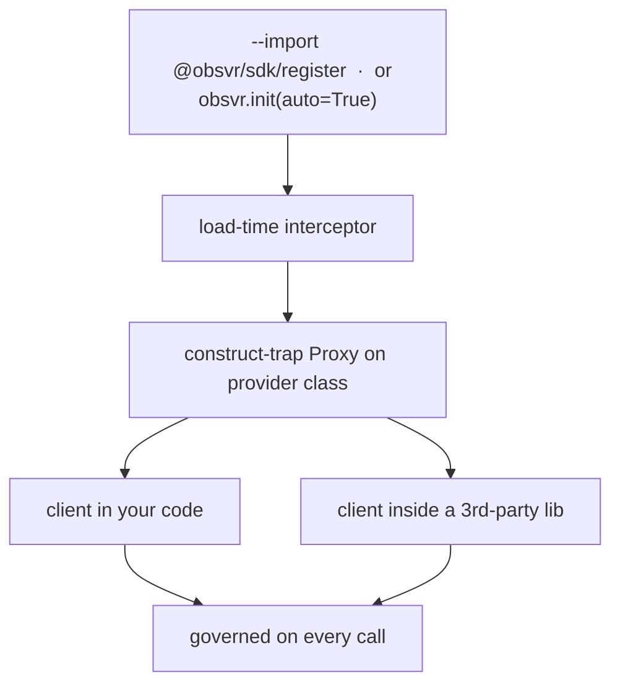
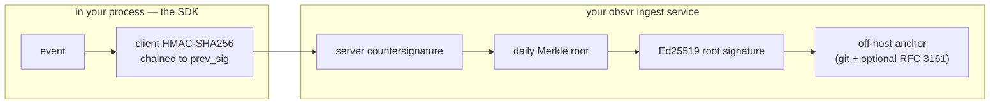

<div align="center">

# obsvr

### Secure and Prove AI agents and LLMs, in real time. Prove exactly what happened, months later.

Intercept every model and tool call. Enforce deterministic policy **before** the request leaves your process. Sign each decision into a tamper-evident event that your obsvr service seals into an independently verifiable record, and reconstruct exactly what your AI did — under which model and which policy — months or years later. We call that **temporal provenance**.


[Website](https://obsvr.dev) · [TypeScript SDK](sdk/) · [Python SDK](sdk-python/)

</div>

---

<p align="center">
  
</p>

> ⚠️ **Private beta.** `@obsvr/sdk` and `obsvr-sdk` are not yet published to npm / PyPI. This repository is the source for beta participants; there is no public install yet. [Request access →](https://obsvr.dev)

Two SDKs — **TypeScript** and **Python** — with **one behavior**, kept byte-for-byte compatible by shared conformance fixtures. Each runs in your process, governs every model and agent call in place, signs each decision into a tamper-evident chain, and hands that record to your obsvr ingest service for sealing.

| Package                    | Language                  | Version | Directory                    |
| -------------------------- | ------------------------- | ------- | ---------------------------- |
| [`@obsvr/sdk`](sdk/)       | TypeScript / Node.js ≥ 18 | 0.10.0  | [`sdk/`](sdk/)               |
| [`obsvr-sdk`](sdk-python/) | Python ≥ 3.9              | 0.10.0  | [`sdk-python/`](sdk-python/) |

## Table of contents

- [Why obsvr](#why-obsvr)
- [Interception model](#interception-model)
- [Quickstart](#quickstart)
- [Policy engine](#policy-engine)
- [PII & sensitive-data detection](#pii--sensitive-data-detection)
- [Agentic & MCP controls](#agentic--mcp-controls)
- [Cost & budget controls](#cost--budget-controls)
- [The record: trust & cryptographic model](#the-record-trust--cryptographic-model)
- [Verifying the record](#verifying-the-record)
- [Framework & provider support](#framework--provider-support)
- [Benchmarks](#benchmarks)
- [Cross-language parity](#cross-language-parity-conformance-is-the-contract)
- [Known limitations & architecture notes](#known-limitations--architecture-notes)
- [License](#license)

---

## Why obsvr

AI agents call models, touch data, take actions, and spend money every day. Most of it is neither **enforced** in real time nor **recorded** in a way that can answer a simple question later:

> _What exactly did our AI do six months ago, which model issued that action, and what policy was in force at the time?_

Governance platforms assess risk from the side, off the request path. Runtime gateways enforce, but only after you route traffic through their network proxy or rewrite your call sites, so governance stalls at a proof of concept and the audit trail is a pile of mutable logs.

The obsvr SDKs run **in-process** — no network gateway, no code changes — and decide with a **deterministic** engine (no second LLM in the decision path). Each decision is signed on capture and delivered to your obsvr ingest service, which seals it into a record you can verify without trusting obsvr — against its published Ed25519 key, not a secret it also holds (see [the record](#the-record-trust--cryptographic-model)) — including the exact model and policy in force at the time. That is what makes the opening question answerable.

---

## Interception model

Two ways in. Both evaluate policy **before the request leaves your process**.

**Explicit** — `obsvr.wrap(client)` governs the clients you choose. Precise, dependency-free, identical in both SDKs.

**Automatic** — governance attaches without touching your call sites:

- **TypeScript** — start Node with the module interceptor:
  ```bash
  node --import @obsvr/sdk/register app.js
  ```
  A module-customization hook loads _before_ your app. When a supported provider module is imported, the SDK swaps its exported class for a **construct-trap `Proxy`**, so every `new OpenAI()`, `new Anthropic()`, and `getGenerativeModel()` created **anywhere in the process returns a governed instance automatically** — including clients constructed deep inside third-party libraries you don't control.
- **Python** — `obsvr.init(auto=True)` auto-instruments providers and frameworks with a clean registration point (OpenAI/Anthropic construction, the OpenAI Agents trace processor, the LlamaIndex callback manager); frameworks that need a per-call handler are detected and reported with the one line to add.



**No global monkey-patching.** The primary paths never mutate a shared prototype, class, or module object: TypeScript wraps with a `Proxy`, and Python uses native framework callbacks and transparent `__getattr__` wrappers (including a non-mutating `govern_mcp()` for MCP). The real client stays a **genuine SDK client**, so APM, OpenTelemetry, and other tracing on the same SDKs keep working, and clients constructed before `init()` pick up governance on their first call after. Two **opt-in** paths are the honest exceptions, documented where they live: the zero-code auto-register replaces a provider's module binding with a governed subclass (Python has no `Proxy` primitive), and the AutoGen helper decorates the single agent instance you hand it — neither touches a class shared with other code.

**Overhead** is one in-process, deterministic policy pass per call plus fire-and-forget event emission that never blocks your LLM path — signing-only adds **~14µs** median in TypeScript. See [Benchmarks](#benchmarks).

---

## Quickstart

**TypeScript**

```bash
npm install @obsvr/sdk    # (private beta — request access)
```

```typescript
import { obsvr } from "@obsvr/sdk";
import OpenAI from "openai";

obsvr.init({
  apiKey: process.env.OBSVR_API_KEY,
  ingestUrl: "https://your-ingest-service", // HTTPS enforced off-localhost
  environment: "production",
  piiPolicy: {
    default: "detect_only",
    rules: { ssn: "block", credit_card: "block" },
  },
});

const openai = obsvr.wrap(new OpenAI());

// Every call is now intercepted, policy-checked, and audited.
await openai.chat.completions.create({
  model: "gpt-4o",
  messages: [{ role: "user", content: "What is 2+2?" }],
});
```

**Python**

```bash
pip install obsvr-sdk    # (private beta — request access)
```

```python
import obsvr
from openai import OpenAI

obsvr.init(
    api_key="your-api-key",
    ingest_url="https://your-ingest-service",  # HTTPS enforced off-localhost
    environment="production",
    pii_policy={"default": "detect_only", "rules": {"ssn": "block", "credit_card": "block"}},
)

client = obsvr.wrap(OpenAI())

# Every call is now intercepted, policy-checked, and audited.
client.chat.completions.create(
    model="gpt-4o",
    messages=[{"role": "user", "content": "What is 2+2?"}],
)
```

Anthropic and Google Gemini wrap identically. See [`sdk/README.md`](sdk/README.md) and [`sdk-python/README.md`](sdk-python/README.md) for the full policy reference, MCP governance, and framework integrations.

---

## Policy engine

Deterministic code only; no LLM in the decision path. Rules run **before** the provider call. **13 rule types** are enforced by the SDK:

`keyword` · `regex` · `topic_allow` · `topic_deny` · `pii` · `action_gate` · `namespace_isolation` · `cross_tenant_block` · `destructive_op_gate` · `source_grounding` · `environment_gate` · `quota` · `model_gate`

```typescript
obsvr.init({
  apiKey: process.env.OBSVR_API_KEY,
  ingestUrl: "https://your-ingest-service",

  policyRules: [
    {
      id: "no-wire-transfers",
      name: "Block wire transfers",
      enabled: true,
      action: "block",
      type: "keyword",
      conditions: { keywords: ["wire transfer"] },
      mode: "enforce",
    }, // enforce | shadow
  ],

  // Human-in-the-loop: a pre-call hook can pause until a human decides.
  onPreCall: async (event) =>
    isHighRisk(event.prompt) ? await waitForHumanApproval(event) : "allow",
  hookTimeoutMs: 2000,
  failMode: "open", // 'open' (default) allows on hook timeout/throw; 'closed' blocks
});
```

**Shadow mode** — set `mode: 'shadow'` on any rule to evaluate it against live traffic and record a would-have outcome without altering the response. Every verdict also carries a stable **`reason_code`** from a closed registry (alongside the free-form `reason`), so downstream tooling classifies decisions without string-matching.

**ReDoS-hardened rules.** Customer-supplied `regex` rules are checked by a static catastrophic-backtracking validator before they can be installed, **and** every match executes against a bounded input slice (≤ 50 KB). Two layers of defense in depth: the validator rejects the known pathological shapes, and the input cap bounds the blast radius of anything that slips past it, so a hostile pattern is contained rather than left to run unbounded against a large input.

**Signed policy distribution.** Pin a policy public key and server-fetched policy is Ed25519-verified over the raw payload; it **fails closed** on tamper, forgery, or version rollback and keeps the last-good policy — so not even obsvr's own servers can push you an unsigned or downgraded ruleset. If the ingest service is unreachable, cached rules keep enforcing; only rule _updates_ degrade. Policies also export to OPA/Rego via the `obsvr-export-rego` CLI for teams running policy-as-code.

**Non-overridable policy floor.** Rules in `policyFloor` (same shape as `policyRules`) are the operator baseline that customer rules and hooks cannot weaken: `enabled: false` / `mode: "shadow"` are ignored, the `onPreCall` hook can never un-block or downgrade a floor match (the attempt is recorded as `floor_override_ignored` on the signed event), and a remote policy sync — which replaces only `policyRules` — cannot delete it. A floor `redact` **fails closed to a block**. Enforced block-before-send on every surface (wrapper, integrations, MCP, and the governance `evaluate()`/`explain()` endpoint). Off by default.

```typescript
obsvr.init({
  // ...
  policyFloor: [
    {
      id: "floor-exfil",
      name: "No secret exfiltration",
      enabled: true,
      action: "block",
      type: "keyword",
      conditions: { keywords: ["exfiltrate secrets"] },
    },
  ],
});
```

> The `pii` rule _type_ is a no-op in the rule engine; PII is enforced by the dedicated scan below, not by authoring a `pii` rule.

---

## PII & sensitive-data detection

Detection runs locally, **before the request leaves your process**, and again post-call for the audit record. Matching is Unicode-normalized (NFKC + zero-width/bidi stripping + a curated confusable fold), so lookalike, fullwidth, and zero-width-obfuscated payloads can't slip a keyword or PII pattern — and redaction scrubs those same forms rather than forwarding them while the event claims "redacted". Each type maps to `block`, `redact`, or `detect_only`. The canonical list is **19 types**:

| Coverage                        | Types                                                                                                                                                       |
| ------------------------------- | ----------------------------------------------------------------------------------------------------------------------------------------------------------- |
| **Built-in regex** (13)         | email, phone, ssn, credit_card (Luhn-validated), ip_address, api_key, aws_access_key, jwt, uuid, private_key, github_token, slack_webhook, prompt_injection |
| **Requires Presidio / NER** (6) | name, address, person, location, medical, national_id                                                                                                       |

The **built-in regex scanner never fires for the 6 NER types** — they require the optional Presidio integration. Policy decisions scan the **last user message**; earlier turns and system prompts are still stored (and redacted if configured) and drive multi-turn injection accumulation, but do not by themselves trigger block/redact.

Default severities: `ssn`, `credit_card`, `api_key`, `aws_access_key`, `jwt`, `private_key`, `github_token`, `slack_webhook`, `prompt_injection` → **block**; `email`, `phone`, `ip_address` → **redact**; the rest **detect_only**. (`ip_address` redacts rather than blocks because the pattern matches any dotted quad — public IPs, `127.0.0.1`, version-like strings — so blocking on it would hard-fail calls that merely mention an IP.)

> **`prompt_injection` is pattern-based**, not an ML jailbreak classifier. It's a curated set of deterministic regexes (normalized for lookalikes) that catches known injection phrasings — a useful signal and defense-in-depth, **not** proof of prevention. Don't rely on it as your only guardrail against adversarial prompts.

**De-obfuscation views (opt-in).** With `deobfuscation: { enabled: true }`, the built-in scanners also see base64/hex/percent-decoded and invisible-stripped / confusable-folded / HTML-comment-stripped views of the text, so encoded or hidden payloads can't dodge detection. Detection-only and bounded (64 KiB input, ≤ 6 views, decode depth 1). A hit found _only_ in a decoded view has no locatable span, so a `redact` resolution escalates to `block` (and stored copies become a `[REDACTED:obfuscated]` placeholder) rather than emit a false "redacted" record while the payload flows through; events carry the view that defeated the obfuscation (`security_normalized`). Off by default — enabling can turn previously-allowed calls into blocks.

Recommended rollout: run `detect_only` for a couple of weeks to baseline what actually flows, then move sensitive types to `redact` or `block`.

---

## Agentic & MCP controls

- **Tool permissioning**, **agent step-budget limits** (escalate for human review on overflow), **destructive-action locks**, and a **kill switch**.
- **`agentRun` scope** — wrap a multi-step agent run so every governed action inside it is grouped under one `agent_run_id` (a single row in the Runs view) and bracketed by signed start/finish events:
  ```typescript
  await obsvr.agentRun("nightly-reconciliation", async () => {
    /* every wrapped model + tool call here shares one agent_run_id */
  });
  ```
  ```python
  with obsvr.agent_run("nightly-reconciliation"):
      ...  # same grouping in Python
  ```
- **MCP governance** — wrap the MCP client non-mutatingly; every tool call on every connected server is policy-checked and audited, and tool descriptions are scanned for **poisoning at discovery**:
  ```typescript
  import { obsvrGovernMCP, getConfig } from "@obsvr/sdk";
  obsvr.init({
    apiKey: "...",
    ingestUrl: "...",
    mcpToolPolicy: { deniedTools: ["delete_file"] },
  });
  const Client = obsvrGovernMCP(RealClient, getConfig()); // Proxy — no prototype patched
  ```
  ```python
  from obsvr.integrations.mcp import govern_mcp
  session = govern_mcp(session)   # __getattr__ wrapper — no ClientSession class patched
  ```
  **Tool-descriptor pinning (rug-pull defense)** — `mcpToolPolicy.pinning` content-hashes each tool descriptor at `tools/list`, so a descriptor silently swapped _after_ approval (a benign tool replaced with a malicious one) is caught: `mode: "warn"` (default) flags it on signed events, `mode: "block"` strips the tool at discovery and refuses calls to it. Operator `pins` (name→hash) are authoritative and survive restarts; otherwise first-seen hashes are TOFU-recorded and never silently re-pinned. Off by default.
  ```typescript
  mcpToolPolicy: { pinning: { enabled: true, mode: "block" } },
  ```
- **Session taint latch** — `sessionTaint: { enabled: true, action: "block" }` latches a session as compromised the moment an injection or canary leak is detected, so later egress from that session is escalated (`flag` by default — annotate, don't brick the session; or `block`). Keyed on `metadata.user_id ?? session_id ?? tenant_id` — thread a session id or everything shares one bucket. Off by default.
- **Canary honeytokens** — `mintCanary()` (Python `mint_canary()`) returns a unique token to plant in a system prompt, retrieved context, or tool output; if it ever resurfaces in a model prompt or response, the SDK raises a CRITICAL leak signal on the signed event and never stores the raw token. A tripwire for prompt-exfiltration and context bleed.

---

## Cost & budget controls

Spending is controlled at the **point of issuance**: token/request quotas and model gates enforced before the call, scoped per user, per service, or per tenant. Each SDK instance sends a stable per-process identity with its policy polls, so the ingest service can escrow a **fleet-wide** quota across instances rather than treating them as one. Note the in-process limits themselves are enforced **per instance** and token usage is recorded post-call — see [Known limitations](#known-limitations--architecture-notes).

---

## The record: trust & cryptographic model

Each governed decision becomes an event. The **SDK** signs it and sends it; your **obsvr ingest service** seals it. Knowing exactly which layer does what is how you decide how much to trust the trail, so it is documented in full.



**What the SDK does:**

1. **Client HMAC chain.** Each event carries a session id, a monotonic sequence number, and an **HMAC-SHA256 signature chained to the previous event's signature** (`prev_sig`), keyed from your API key and covering the prompt/response **content** and the event **order**. Any edit, drop, or reorder of captured events breaks the chain detectably.
2. **Fire-and-forget delivery.** Signed events are queued and delivered with retry/backoff off your LLM path; a backend outage degrades rule _updates_, not enforcement.

**What your obsvr ingest service does** (attributed here because the SDK does not do these — it hands the signed events over):

3. **Server countersignature** over the full canonical event (verdict, rule, tenant included), with a key that never leaves the service — binding each accepted event, and its decision fields, to its moment of acceptance.
4. **Daily Merkle root** folding each day's events, **Ed25519-signed** with a published public key, and **anchored off-host** (append-only git, optionally with an RFC 3161 timestamp) on storage separate from the runtime that produced the events.

### What this guarantees, and what it does not

**Guaranteed (cryptographic).** Once a day is sealed and anchored by the service, the record cannot be **altered, deleted, reordered, or backdated** without breaking the Ed25519-signed root, which anyone can detect with the published public key. This defeats after-the-fact revision — the actual attack in a compliance dispute.

**Not guaranteed (client-attested).** The client chain does **not** prove an event corresponds to a real LLM call rather than one fabricated at capture by a party holding the API key. HMAC is symmetric and providers don't sign their responses, so no in-process tool can prove non-fabrication at capture. Treat the client chain as **integrity, not non-repudiation against a key-holder**, and protect the API key like the signing credential it is. External, public verifiability comes from the service's Ed25519-signed, off-host-anchored root — not the symmetric HMAC layer.

**What leaves your process is your choice.** With redaction configured, raw prompts and responses can stay entirely in your environment; the SDK can emit only content hashes, signatures, and verdicts.

---

## Verifying the record

The TypeScript SDK ships the **`obsvr-verify`** CLI:

```bash
# structure verification (no key)
npx obsvr-verify ./bundle.json

# full client HMAC-chain re-verification
npx obsvr-verify ./bundle.json --api-key <key>
```

Exit code `0` = verified at the requested tier, `1` = broken, `2` = usage error. This re-checks the **client HMAC chain** — capture order and content integrity — with your key, independently of obsvr. The **public-key-only** check (recompute the Merkle root from raw events and verify the Ed25519 root signature with the published public key, no obsvr account) is performed by your obsvr ingest service's bundle verifier over an exported audit bundle; the SDK's job is to produce events that verify identically wherever they're checked, which the [conformance fixtures](#cross-language-parity-conformance-is-the-contract) pin.

---

## Framework & provider support

**Providers (auto-governed):** OpenAI · Anthropic · Google Gemini
**Also supported:** Azure OpenAI · AWS Bedrock · Google Vertex AI · Together · Cloudflare Workers AI · any OpenAI-compatible API (Groq, Mistral, Ollama)

| Framework                 | TypeScript | Python |
| ------------------------- | :--------: | :----: |
| OpenAI Agents SDK         |     ✅     |   ✅   |
| LangChain                 |     ✅     |   ✅   |
| LlamaIndex                |     ✅     |   ✅   |
| Vercel AI SDK             |     ✅     |   —    |
| CrewAI                    |     —      |   ✅   |
| AutoGen                   |     —      |   ✅   |
| Haystack                  |     —      |   ✅   |
| Pydantic-AI               |     —      |   ✅   |
| Semantic Kernel           |     —      |   ✅   |
| Microsoft Agent Framework |     —      |   ✅   |
| Google ADK                |     —      |   ✅   |
| smolagents                |     —      |   ✅   |
| FastAPI / ASGI middleware |     —      |   ✅   |
| MCP                       |     ✅     |   ✅   |

---

## Benchmarks

Governance overhead added by the SDK per governed call, measured against an in-process mock provider so the SDK's own cost is isolated from provider latency (Apple M3 Pro, 10,000 calls/config; signing always on). Overhead scales with rule count and prompt size, so these are the shapes, not a single number:

| Config              | What it adds                                  | TypeScript (p50) | Python (mean¹) |
| ------------------- | --------------------------------------------- | ---------------: | -------------: |
| Sign only           | event build + hash + HMAC sign + enqueue      |       **13.6µs** |     **91.9µs** |
| + 5 rules           | rule eval + NFKC normalization + ruleset hash |           22.5µs |          126µs |
| + PII scan          | built-in regex PII detection                  |           31.5µs |          144µs |
| Full stack          | + hooks + multi-turn injection + shadow rules |       **45.1µs** |      **310µs** |
| Full @ 10 KB prompt | large-payload hashing + scanning              |           ~1.3ms |              — |

¹ Python p50s are bimodal at sub-150µs scale (GIL interplay with the sender thread), so means are published for those cells; means and p95s are stable across passes. Full percentiles, stress tiers (100k+ sustained calls), and methodology in [`BENCHMARKS.md`](BENCHMARKS.md).

For a real LLM call (hundreds to thousands of ms), a typical config is **well under 0.1%** of the round-trip, and event delivery is off the caller's path entirely.

---

## Cross-language parity: `conformance/` is the contract

The two SDKs are kept byte-for-byte compatible by shared fixtures in [`conformance/fixtures/`](conformance/fixtures/), asserted by both test suites:

- `signing_vectors.json` — the HMAC signing chain: both suites must produce **byte-identical signatures**, so the ingest service verifies events from either SDK with the same code.
- `eval_semantics.json` — policy-rule evaluation semantics, including shadow-mode inertness.
- `rules_hash.json` — the canonical `policy_version` hash of a rule set, derived identically in both languages.
- `reason_codes.json` — the closed registry of verdict reason codes; a staleness check in each SDK fails if the registries diverge or the engine emits an unregistered code.
- `normalization.json`, `otel_attributes.json`, `effective_policy.json` — Unicode-normalization, telemetry-attribute, and effective-policy parity.

A fixture failing in one language is a release blocker unless recorded in [`conformance/known-divergences.md`](conformance/known-divergences.md) — currently **empty**. Any behavior change must update the fixtures **and** both implementations in the same change.

---

## Known limitations & architecture notes

Documented plainly, from the code. For the full threat model — what the signature chain does and does not prove — and how to report a vulnerability, see [SECURITY.md](SECURITY.md).

- **Streaming.** With `stream: true`, PII scanning and policy hooks run **before** the LLM is contacted, so a blocked call never opens the stream. But **post-call** response scanning on streamed output is audit-time, not enforcement-time: tokens reach the caller as they arrive.
- **Signing model.** The client chain is symmetric (API-key-derived): it proves capture order and detects modification, but a key-holder could construct validly-signed events. The service's countersignature and Ed25519 root are what give external, public verifiability. Integrity, not non-repudiation against a key-holder.
- **Enforcement vs. sampling.** `sampleRate` gates audit-event _emission_ only — enforcement (PII, rules, hooks) runs on **every** call regardless of the sample rate.
- **Fail mode.** Default is **fail-open**: if a pre-call hook times out or throws, the call is allowed and the failure is recorded. Set `failMode: 'closed'` for policies that must never fail open (and note that a closed policy with rule-polling disabled degrades to last-good rules).
- **PII scope.** Policy decisions scan the last user message; `name`, `address`, `person`, `location`, `medical`, `national_id` require Presidio and never fire on the built-in regex.
- **Budget scope.** In-process token/request budgets are enforced **per SDK instance**, and token usage is recorded post-call, so N instances can allow up to N× a limit and budgets lag by one call. Fleet-wide quota escrow is coordinated by the ingest service; enforce hard global caps upstream if you need them.
- **Serverless.** Each cold start begins a fresh integrity session (`sdk_session_id`, `seq_no` reset). Multiple sessions starting at `seq_no=1` are expected and verify correctly. Call `await obsvr.flush()` before the runtime freezes.
- **SDK bypass.** Not calling `init()` means no coverage — there is no post-hoc runtime check; assert `obsvr.isInitialized()` at startup. `disabled: true` in production emits a `governance_disabled` event so the bypass is on the record.

---

## License

Apache-2.0 © obsvr. See [LICENSE](LICENSE) and [NOTICE](NOTICE).

Access, integration help, or security questions: **hello@obsvr.dev**
