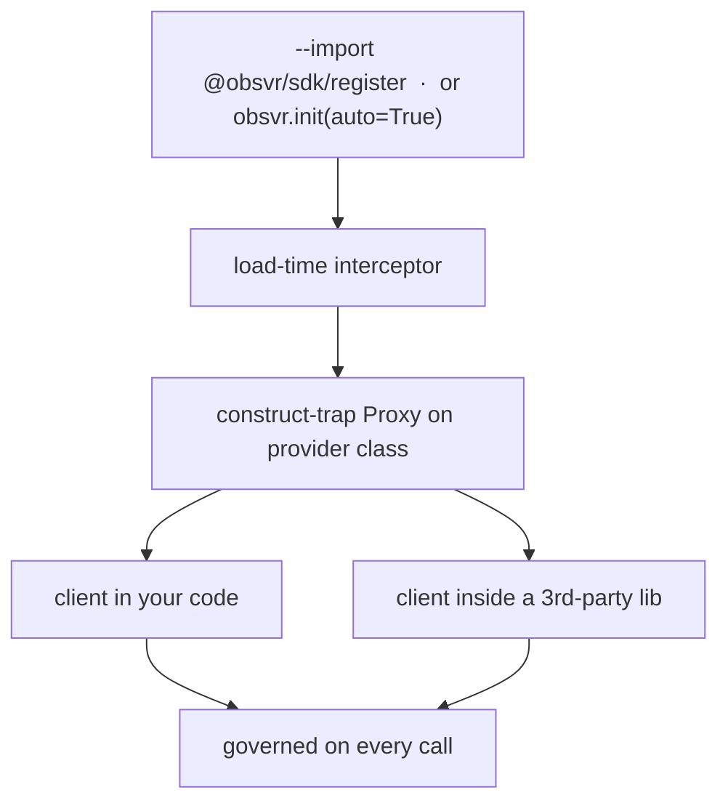
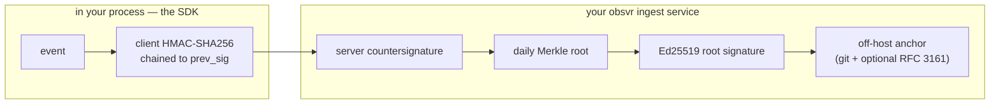

<div align="center">

# obsvr

### Secure and Prove AI agents and LLMs, in real time. Prove exactly what happened, months later.

Intercept model and tool calls at the provider-call boundary. Enforce deterministic policy **before** the request leaves your process. Sign each decision into a tamper-evident event that your obsvr service seals into an independently verifiable record, and reconstruct exactly what your AI did — under which model and which policy — months or years later. We call that **temporal provenance**.


[Website](https://obsvr.dev) · [TypeScript SDK](sdk-typescript/) · [Python SDK](sdk-python/)

</div>

---

<p align="center">
  
</p>

> **The SDKs are public; the ingest service is in private beta.** `@obsvr/sdk` and `obsvr-sdk` install from npm and PyPI with no gate. Enforcement runs entirely in your process and needs no account — policy, PII, and agent checks block calls with nothing configured but an API key. Delivering the signed record needs an ingest service, and you receive its URL together with your key. [Request access →](https://obsvr.dev)

Two SDKs — **TypeScript** and **Python** — with **one behavior**, kept byte-for-byte compatible by shared conformance fixtures. Each runs in your process, governs the model and agent calls that pass through its interception points, signs each decision into a tamper-evident chain, and hands that record to your obsvr ingest service for sealing. **Which calls those are is a per-integration property, not an SDK-wide one** — see [Framework & provider support](#framework--provider-support) for the measured state of each, in both languages.

| Package                    | Language                  | Version | Directory                    |
| -------------------------- | ------------------------- | ------- | ---------------------------- |
| [`@obsvr/sdk`](sdk-typescript/)       | TypeScript / Node.js ≥ 22 | 0.11.1  | [`sdk-typescript/`](sdk-typescript/)               |
| [`obsvr-sdk`](sdk-python/) | Python ≥ 3.10             | 0.11.1  | [`sdk-python/`](sdk-python/) |

## Table of contents

- [Why obsvr](#why-obsvr)
- [Interception model](#interception-model)
- [Quickstart](#quickstart)
- [Policy engine](#policy-engine)
- [PII & sensitive-data detection](#pii--sensitive-data-detection)
- [Agentic & MCP controls](#agentic--mcp-controls)
- [Identity & attribution](#identity--attribution)
- [Cost & budget controls](#cost--budget-controls)
- [The record: trust & cryptographic model](#the-record-trust--cryptographic-model)
- [What's in this repo, what isn't, and why](#whats-in-this-repo-what-isnt-and-why)
- [Verifying the record](#verifying-the-record)
- [Framework & provider support](#framework--provider-support)
- [Benchmarks](#benchmarks)
- [Cross-language parity](#cross-language-parity-conformance-is-the-contract)
- [Known limitations & architecture notes](#known-limitations--architecture-notes)
- [License](#license)

---

## Why obsvr

AI agents call models, touch data, take actions, and spend money every day. Most of it is neither **enforced** in real time nor **recorded** in a way that can answer a simple question later:

> _What exactly did our AI do six months ago, which model issued that action, and what policy was in force at the time?_

Governance platforms assess risk from the side, off the request path. Runtime gateways enforce, but only after you route traffic through their network proxy or rewrite your call sites, so governance stalls at a proof of concept and the audit trail is a pile of mutable logs.

The obsvr SDKs run **in-process** — no network gateway, no code changes — and decide with a **deterministic** engine (no second LLM in the decision path). Each decision is signed on capture and delivered to your obsvr ingest service, which seals it into a record you can verify without trusting obsvr — against its published Ed25519 key, not a secret it also holds (see [the record](#the-record-trust--cryptographic-model)) — including the exact model and policy in force at the time. That is what makes the opening question answerable.

---

## Interception model

Two ways in. Both evaluate policy **before the request leaves your process**.

**Explicit** — `obsvr.wrap(client)` governs the clients you choose. Precise, dependency-free, identical in both SDKs.

**Automatic** — governance attaches without touching your call sites:

- **TypeScript** — start Node with the module interceptor:
  ```bash
  node --import @obsvr/sdk/register app.js
  ```
  A module-customization hook loads _before_ your app. When a supported provider module is imported **by its exact package specifier from ESM**, the SDK swaps that module's exported client class for a **construct-trap `Proxy`**, so `new OpenAI()`, `new Anthropic()` and `getGenerativeModel()` return governed instances automatically — including clients constructed deep inside third-party libraries you don't control.

  Some entry points fall outside the hook — see
  [Before you install](#before-you-install-the-eight-limits-worth-knowing).
  An escaped client records nothing rather than something false, and
  `obsvr.wrap()` governs all of them.
- **Python** — `obsvr.init(auto=True)` auto-instruments providers and frameworks with a clean registration point (OpenAI/Anthropic construction, the OpenAI Agents trace processor, the LlamaIndex callback manager); frameworks that need a per-call handler are detected and reported with the one line to add.


```mermaid
flowchart TD
    reg["--import @obsvr/sdk/register  ·  or  obsvr.init(auto=True)"] --> hook["load-time interceptor"]
    hook --> trap["construct-trap Proxy on provider class"]
    trap --> a["client in your code"]
    trap --> b["client inside a 3rd-party lib"]
    a --> gov["governed on every call"]
    b --> gov
```

**No global monkey-patching.** The primary paths never mutate a shared prototype, class, or module object: TypeScript wraps with a `Proxy`, and Python uses native framework callbacks and transparent `__getattr__` wrappers (including a non-mutating `govern_mcp()` for MCP). The real client stays a **genuine SDK client**, so APM, OpenTelemetry, and other tracing on the same SDKs keep working, and clients constructed before `init()` pick up governance on their first call after. AutoGen's `register_obsvr()` likewise decorates only the single agent instance you hand it. Four **opt-in** paths are the exceptions, each documented where it lives, and three of them reach state shared with other code: the zero-code auto-register replaces a provider's module binding with a governed subclass (Python has no `Proxy` primitive); the legacy `patch_mcp()` patches the `ClientSession` class, which is why `govern_mcp()` exists beside it; AutoGen's `install_tool_gate()` patches `ConversableAgent.execute_function` / `a_execute_function` **at class level, by design** — every executor the framework builds for a run is a `ConversableAgent`, including hidden ones the caller never constructs, so the class is the only place a gate reaches them all; and CrewAI's `install_tool_gate_hook()` registers on a **process-global** hook system, the only scope CrewAI offers for tool hooks, so it applies to every crew in the process. The last two each return an uninstall callable, and none of the four is on by default.

**Overhead** is one in-process, deterministic policy pass per call plus event emission that does not wait on the ingest transport — a slow or dead backend does not slow your calls (measured: a 25 ms-per-POST transport leaves the hot path unchanged). Signing-only adds **~14µs** median in TypeScript. See [Benchmarks](#benchmarks).

**One exception, stated because it is the only thing on that path that can block:** with `otel` mirroring configured, the TypeScript sender calls the exporter **synchronously, before the enqueue** — a span that takes 300 ms to start blocks the caller for 300 ms. Python mirrors after the enqueue and exposes only the caller's latency.

---

## Quickstart

> Read [the eight limits worth knowing](#before-you-install-the-eight-limits-worth-knowing)
> first. Five of them are specific to one of the two SDKs.

**TypeScript**

```bash
npm install @obsvr/sdk
```

Requires **Node.js >= 22**, and the package is **ESM-only** — a CommonJS service
cannot `require()` it, and the zero-code `--import` path does not intercept
`require()` even where the package loads. Dual-publishing is future work; the
reason it is not a quick win is in the [TypeScript README](sdk-typescript/README.md#this-package-is-esm-only).

```typescript
import { obsvr } from "@obsvr/sdk";
import OpenAI from "openai";

obsvr.init({
  apiKey: process.env.OBSVR_API_KEY,
  ingestUrl: "https://your-ingest-service", // HTTPS enforced off-localhost
  environment: "production",
  piiPolicy: {
    default: "detect_only",
    rules: { ssn: "block", credit_card: "block" },
  },
});

const openai = obsvr.wrap(new OpenAI());

// Every call is now intercepted, policy-checked, and audited.
await openai.chat.completions.create({
  model: "gpt-4o",
  messages: [{ role: "user", content: "What is 2+2?" }],
});
```

**Python**

```bash
pip install obsvr-sdk
```

```python
import obsvr
from openai import OpenAI

obsvr.init(
    api_key="your-api-key",
    ingest_url="https://your-ingest-service",  # HTTPS enforced off-localhost
    environment="production",
    pii_policy={"default": "detect_only", "rules": {"ssn": "block", "credit_card": "block"}},
)

client = obsvr.wrap(OpenAI())

# Every call is now intercepted, policy-checked, and audited.
client.chat.completions.create(
    model="gpt-4o",
    messages=[{"role": "user", "content": "What is 2+2?"}],
)
```

Anthropic and Google Gemini wrap identically — for Gemini, against the legacy SDK (`@google/generative-ai` / `google-generativeai`); the current one is [not yet supported](#framework--provider-support). See [`sdk-typescript/README.md`](sdk-typescript/README.md) and [`sdk-python/README.md`](sdk-python/README.md) for the full policy reference, MCP governance, and framework integrations.

---

## Policy engine

Deterministic code only; no LLM in the decision path. Rules run **before** the provider call. Fourteen rule types are declared, and **13 are enforced by the rule engine** — `pii` is a valid policy type with no rule-engine branch by design, because PII is enforced by the dedicated scan below rather than by authoring a `pii` rule:

`keyword` · `regex` · `topic_allow` · `topic_deny` · `pii` · `action_gate` · `namespace_isolation` · `cross_tenant_block` · `destructive_op_gate` · `source_grounding` · `environment_gate` · `quota` · `model_gate` · `protocol_facet`

`protocol_facet` matches **parsed** statement structure rather than raw characters — `{ facet: "sql.verb", facet_not_in: ["select"] }` reads the decomposed statement, so it survives a comment, a quote-style change or a line break that defeats a regex, and it does not fire on prose that merely mentions the word. Facets today are `sql.verb`, `sql.target`, `sql.tables`, `sql.functions` and `sql.multiple_statements`. The decomposition is stdlib-only and lexical rather than a full grammar (this package ships no runtime dependencies), so it is explicit about what it cannot read — and text it cannot decompose **matches**, because a rule that cannot evaluate must not quietly permit.

```typescript
obsvr.init({
  apiKey: process.env.OBSVR_API_KEY,
  ingestUrl: "https://your-ingest-service",

  policyRules: [
    {
      id: "no-wire-transfers",
      name: "Block wire transfers",
      enabled: true,
      action: "block",
      type: "keyword",
      conditions: { keywords: ["wire transfer"] },
      mode: "enforce",
    }, // enforce | shadow
  ],

  // Custom pre-call hook: allow | block | redact. Enforcement is monotonic:
  // "allow" keeps a clean call allowed but never erases a PII/rule block.
  // Budgeted by hookTimeoutMs and resolved by failMode on expiry — for human
  // approval, use approvalWaitMs below, not a hook that waits.
  onPreCall: async (event) =>
    isHighRisk(event.prompt) ? "block" : "allow",
  hookTimeoutMs: 2000,
  failMode: "open", // 'open' (default) allows on hook/detector failure; 'closed' blocks.
                    // Floors, canary, and a failed redaction block either way.

  // Human-in-the-loop: hold a require_approval block while the grant
  // channel is polled. 0 (default) = refuse now, pass on a retry once granted.
  approvalWaitMs: 300_000,
  approvalPollMs: 5_000,
});
```

**Blocking human approval.** A rule with `require_approval` refuses when no
grant covers the call and files a request for the dashboard's approvals queue;
a retry passes once a human grants it. That is the default, and
`approvalWaitMs: 0` means exactly that — no waiting. Set it above zero and the
SDK **holds the call in-process** instead, polling the grant channel until a
covering grant lands or the budget expires. Only an explicit, still-live grant
lifts the hold — the grant is re-validated after the wait, so one that expires
or is revoked mid-hold authorizes nothing — and an expired hold blocks with its
own registry code, **`APPROVAL_TIMEOUT`**, distinct from `APPROVAL_REQUIRED` so
a run-out hold is never conflated with a plain refusal. Degradation mid-wait
(kill switch, fail-closed staleness) aborts the hold immediately and the block
stands. One limitation worth knowing rather than discovering: **a denial is
currently indistinguishable from indecision client-side.** The grant channel
carries grants, not verdicts, so a request a human explicitly denied surfaces
as the same `APPROVAL_TIMEOUT` as a request nobody looked at. And do not build
this out of the hook: the pre-call hook is budgeted by `hookTimeoutMs` (2000 ms
default) and resolves by `failMode` on expiry — at shipped defaults a hook that
waits for a human times out and **allows**.

**Shadow mode** — set `mode: 'shadow'` on any rule to evaluate it against live traffic and record a would-have outcome without altering the response. Every verdict — and every audit **event** — also carries a stable **`reason_code`** from a closed registry (alongside the free-form `reason`): the deciding layer's own fine-grained code, identical on the event and the thrown error, so downstream tooling classifies decisions without string-matching.

**Rule ordering, and opting out of it.** By default rules evaluate
**first-match in document order**, and a matched `topic_allow`
short-circuits — so an allow rule's list position can decide the verdict, and
reordering a ruleset can change what it blocks. That contract stays the
default because deployed policies may depend on it. Declaring
`ruleResolution: 'deny_wins'` (`rule_resolution="deny_wins"` in Python) opts a
deployment out: every enforcing rule is evaluated and the **strongest action
prevails regardless of position** — refusal over redaction over flag over
permit, smallest rule id breaking ties — and decisions carry engine version
`obsvr-rules/2`. The stamped `policy_version` commits to the declared
semantics: under a declared `first_match` it commits to evaluation order, so
two orderings that can decide differently stamp distinct versions, while
undeclared rulesets keep their existing hash bytes. An unknown declaration is
refused at `init()`, never silently evaluated under semantics the author did
not choose. Two deliberate edges, both pinned in tests rather than left to be
discovered: **shadow rules evaluate first-match regardless** of the declared
mode, and under `deny_wins` **every quota rule meters every evaluated call**
— order-insensitive evaluation means a call that ends blocked can still
consume quota, where first-match stopped metering at its first match.

**Global monitor mode.** `enforcementMode: 'monitor'`
(`enforcement_mode="monitor"` in Python) is one flip meaning "keep deciding
and recording, stop enforcing": every layer still evaluates, every event
still emits, and a final block is converted to an allow whose
`shadow_outcome` carries the would-be verdict with the same `rule_id` and
`reason_code` an enforcing run records — a staged rollout or rollback that
keeps the evidence stream intact. Two classes enforce in **both** modes: the
enforcement-integrity gate (kill switch / fail-closed staleness), whose
verdict is re-derived at the moment of conversion so a stale snapshot cannot
extend monitor mode to a paused project or revoked key, and canary-leak
blocks — an exfiltration in flight is stopped in any mode. A converted event
is enforcement evidence, not a plain allowed call, so it is exempt from
allowed-call sampling and survives even `sampleRate: 0`. `explain()` keeps
predicting **enforce**-mode behaviour, so the pre-flight check still
describes what turning enforcement on would do rather than echoing the
current mode back.

**Catching a block.** A blocked call throws `ObsvrPolicyError` (both SDKs), carrying a stable `type`, the `reason_code`, the deciding `rule_id`, and the decision metadata — so "refused on purpose" is distinguishable from a provider outage without matching on a message. A reason category the SDK doesn't recognize (a newer control plane) yields `ObsvrUnknownPolicyError` rather than an untyped throw. The Python class subclasses `RuntimeError`, and the message string is unchanged from earlier versions, so existing `except` blocks and string matches keep working.

```typescript
import { ObsvrPolicyError } from "@obsvr/sdk";

try {
  await openai.chat.completions.create({ ... });
} catch (err) {
  if (err instanceof ObsvrPolicyError) {
    console.warn(`refused: ${err.reason_code} by ${err.rule_id ?? "builtin"}`);
  } else {
    throw err; // provider or transport failure — not a policy decision
  }
}
```

**ReDoS-hardened rules.** Customer-supplied `regex` rules are checked by a static catastrophic-backtracking validator before they can be installed, **and** every match executes against a bounded input slice (≤ 50 KB). Two layers of defense in depth: the validator rejects the known pathological shapes, and the input cap bounds the blast radius of anything that slips past it, so a hostile pattern is contained rather than left to run unbounded against a large input. "Before they can be installed" covers both tiers as of this release — it used to run on the `/policies` poll only, so a pattern the validator refuses could be declared in `init()` and then simply never match, which at the verdict is indistinguishable from a rule that ran and found nothing.

**A rule you declare in `init()` is validated at `init()`, and an unusable one is refused there.** Both tiers now hold a rule to the same schema; they differ only in what an invalid rule costs. A `/policies` poll **drops** it — one bad rule must not brick a fleet — and fires the `sdk:rule_rejected` signal naming the id. `init()` **throws**, naming the index and the field, because the author is right there and there is no later moment at which unreadable configuration becomes readable. What this catches: a missing `enabled` flag or a misspelled `type`, either of which produced a rule the engine skipped in silence; a rule id claiming the reserved `sdk:` / `backend:` namespace; and a `regex` pattern the ReDoS validator refuses.

In Python, `policy_rules` and `policy_floor` accept **either** `PolicyRule` objects or plain mappings:

```python
import obsvr

obsvr.init(
    api_key=os.environ["OBSVR_API_KEY"],
    ingest_url="https://your-ingest-service",
    policy_rules=[
        {
            "id": "no-wire-transfers",
            "name": "Block wire transfers",
            "enabled": True,
            "action": "block",
            "type": "keyword",
            "conditions": {"keywords": ["wire transfer"]},
        },
    ],
)
```

The mapping form is new. It previously reached the rule engine uncoerced and raised on the first attribute read, where the detector guard resolved the raise by `failMode` — open by default — so a `block` rule written this way did not block and the call went to the provider behind a stderr notice. `policy_floor` already accepted mappings, which is most of why a caller expected `policy_rules` to.

**Signed policy distribution (both languages).** Pin a policy public key and server-fetched policy is Ed25519-verified over the raw payload; it **fails closed** on tamper, forgery, or version rollback and keeps the last-good policy — so not even obsvr's own servers can push you an unsigned or downgraded ruleset. Python needs an Ed25519 backend for this (`pip install "obsvr-sdk[crypto]"`); with a key pinned and none installed the policy is **refused**, not waved through, and the event says which. If the ingest service is unreachable, cached rules keep enforcing; only rule _updates_ degrade. Policies also export to OPA/Rego for teams running policy-as-code; the `obsvr-export-rego` CLI that writes the bundle ships in the **TypeScript** package only.

**Non-overridable policy floor.** Rules in `policyFloor` (same shape as `policyRules`) are the operator baseline that customer rules and hooks cannot weaken: `enabled: false` / `mode: "shadow"` are ignored, the `onPreCall` hook can never un-block or downgrade a floor match (the attempt is recorded as `floor_override_ignored` on the signed event), and a remote policy sync cannot delete it. Rule precedence is three tiers with three lifetimes: the **floor** survives everything; **`policyRules` you declare in `init()`** survive a poll and are replaced only by another `init()`; the **server's own rules** are the poll's to manage, and an empty ruleset legitimately clears them. A poll used to replace all of it, so a `200` carrying `{"rules":[]}` erased locally declared rules while stamping the sync successful — disarming a deployment via a response nobody sees. A floor `redact` **fails closed to a block**. Off by default.

**Where the floor is verified to reach, measured rather than asserted.** Driven live: it blocks before send on the client wrapper, on a framework integration, and on MCP tool arguments — the destination is never reached and the event records `blocked` with `floor_version` stamped, so a floor change is auditable from the event stream. A customer `onPreCall` hook returning "allow" does **not** un-block a floor match on any of the three. Two limits worth knowing rather than discovering: in **Python** the `floor_override_ignored` record of a refused override attempt lands only on the **wrapper** path, so on the integrations and on MCP the block stands but the attempt to weaken it is not recorded (TypeScript records it on every integration path — `integrations/core.ts` produces it and Bedrock, Vertex, Vercel AI, the compatibility wrappers, Cloudflare and MCP all merge it onto the event); and the governance `evaluate()`/`explain()` endpoint is covered by unit tests in both languages but was not driven in that live pass. "Every surface" is the design intent and is evidenced on three of the four.

```typescript
obsvr.init({
  // ...
  policyFloor: [
    {
      id: "floor-exfil",
      name: "No secret exfiltration",
      enabled: true,
      action: "block",
      type: "keyword",
      conditions: { keywords: ["exfiltrate secrets"] },
    },
  ],
});
```

> The `pii` rule _type_ is a no-op in the rule engine; PII is enforced by the dedicated scan below, not by authoring a `pii` rule.

---

## PII & sensitive-data detection

Detection runs locally, **before the request leaves your process**, and again post-call for the audit record. Matching is Unicode-normalized (NFKC + zero-width/bidi stripping + a curated confusable fold), so lookalike, fullwidth, and zero-width-obfuscated payloads can't slip a keyword or PII pattern. Each type maps to `block`, `redact`, or `detect_only`. The canonical list is **19 types**:

<details><summary>Why the Unicode fold is vendored rather than left to the host runtime</summary>

The fold is deliberately not left to the host runtime, because NFKC is not a stable cross-language primitive: Node folds through ICU, which tracks the current Unicode release, while CPython ships a frozen table per minor version, so every Unicode release leaves a residue one runtime folds to ASCII and the other does not (measured: 41 such codepoints at the declared Python floor, 37 at 3.12/3.13, 1 at 3.14 — never zero). Those are vendored into the curated fold, so both SDKs agree whatever Unicode version they ship — and redaction scrubs those same forms rather than forwarding them while the event claims "redacted".

</details>

| Coverage                        | Types                                                                                                                                                       |
| ------------------------------- | ----------------------------------------------------------------------------------------------------------------------------------------------------------- |
| **Built-in regex** (13)         | email, phone, ssn, credit_card (Luhn-validated), ip_address, api_key, aws_access_key, jwt, uuid, private_key, github_token, slack_webhook, prompt_injection |
| **Requires Presidio / NER** (6) | name, address, person, location, medical, national_id                                                                                                       |

The **built-in regex scanner never fires for the 6 NER types** — they require the optional Presidio integration. Policy decisions scan the **last user message**. Earlier turns, system prompts, assistant turns and tool results still reach the audit record and still drive multi-turn injection accumulation, but do not by themselves trigger block/redact, so **the request reaches the provider unmodified**. The stored copy is a separate question and is answered separately: when a detected type resolves to `block` or `redact`, the value is scrubbed from the recorded prompt wherever in the conversation it sat, and the event says so — **on the `wrap()` front door in both languages, and on the framework integrations in TypeScript only.** Python's integration emit path does not run that net, so on Bedrock and Vertex an unreached role's PII is stored raw. The sentence used to be unqualified by surface and by language — `stored_redaction_types`, plus `stored_redaction_outbound_unmodified` so a redacted record beside an `allowed` verdict cannot be read as prevention. Under `detect_only` the record keeps the raw value, which is what that mode is for.

Default severities: `ssn`, `credit_card`, `api_key`, `aws_access_key`, `jwt`, `private_key`, `github_token`, `slack_webhook`, `prompt_injection` → **block**; `email`, `phone`, `ip_address` → **redact**; the rest **detect_only**. (`ip_address` redacts rather than blocks because the pattern matches any dotted quad — public IPs, `127.0.0.1`, version-like strings — so blocking on it would hard-fail calls that merely mention an IP.)

> **`prompt_injection` is pattern-based**, not an ML jailbreak classifier. It's a curated set of deterministic regexes (normalized for lookalikes) that catches known injection phrasings — a useful signal and defense-in-depth, **not** proof of prevention. Don't rely on it as your only guardrail against adversarial prompts.

**De-obfuscation views (opt-in).** With `deobfuscation: { enabled: true }`, the built-in scanners also see base64/hex/percent-decoded and invisible-stripped / confusable-folded / HTML-comment-stripped views of the text, so encoded or hidden payloads can't dodge detection. Both SDKs also strip CSS-hidden (`display:none`, `visibility:hidden`) and `aria-hidden="true"` markup, which closes the trick of splitting a phrase with hidden junk so a substring scanner misses what the model still reads whole. Detection-only and bounded (64 KiB input, ≤ 6 views, decode depth 1). A hit found _only_ in a decoded view has no locatable span, so a `redact` resolution escalates to `block` (and stored copies become a `[REDACTED:obfuscated]` placeholder) rather than emit a false "redacted" record while the payload flows through; events carry the view that defeated the obfuscation (`security_normalized`). Off by default — enabling can turn previously-allowed calls into blocks.

Recommended rollout: run `detect_only` for a couple of weeks to baseline what actually flows, then move sensitive types to `redact` or `block`.

---

## Agentic & MCP controls

- **Tool permissioning**, **agent step-budget limits** (escalate for human review on overflow), **destructive-action locks**, and a **kill switch**.
- **`agentRun` scope** — wrap a multi-step agent run so every governed action inside it is grouped under one `agent_run_id` (a single row in the Runs view) and bracketed by signed start/finish events:
  ```typescript
  await obsvr.agentRun("nightly-reconciliation", async () => {
    /* every wrapped model + tool call here shares one agent_run_id */
  });
  ```
  ```python
  with obsvr.agent_run("nightly-reconciliation"):
      ...  # same grouping in Python
  ```
- **MCP governance** — wrap the MCP client non-mutatingly; every tool call on every connected server is policy-checked and audited, and tool descriptions are scanned for **poisoning at discovery**:
  ```typescript
  import { obsvrGovernMCP, getConfig } from "@obsvr/sdk";
  obsvr.init({
    apiKey: "...",
    ingestUrl: "...",
    mcpToolPolicy: { deniedTools: ["delete_file"] },
  });
  const Client = obsvrGovernMCP(RealClient, getConfig()); // Proxy — no prototype patched
  ```
  ```python
  from obsvr.integrations.mcp import govern_mcp
  session = govern_mcp(session)   # __getattr__ wrapper — no ClientSession class patched
  ```
  **Tool-descriptor pinning (rug-pull defense)** — `mcpToolPolicy.pinning` content-hashes each tool descriptor at `tools/list`, so a descriptor silently swapped _after_ approval (a benign tool replaced with a malicious one) is caught: `mode: "warn"` (default) flags it on signed events, `mode: "block"` strips the tool at discovery and refuses calls to it. Operator `pins` (name→hash) are authoritative and survive restarts; otherwise first-seen hashes are TOFU-recorded and never silently re-pinned. Off by default.
  ```typescript
  mcpToolPolicy: { pinning: { enabled: true, mode: "block" } },
  ```
- **Session taint latch** — `sessionTaint: { enabled: true, action: "block" }` latches a session as compromised when an injection or canary leak is detected. **The injection half needs a co-requisite and does not arm without it:** the latch is set inside the PII scan, so `piiPolicy` must be configured with `prompt_injection` enabled (`piiPolicy: { rules: { prompt_injection: "detect_only" } }` is enough) or nothing ever detects an injection to latch on. The canary half arms on its own. Measured: `sessionTaint` alone, exactly as this option used to be documented, left a destructive tool executing; with the `prompt_injection` rule added it went to zero. Once armed, so later egress from that session is escalated (`flag` by default — annotate, don't brick the session; or `block`). `destructiveTools: ["send_money", ...]` names exact tools a tainted session may never invoke **even in flag mode** — ordinary egress stays flagged while the capabilities that could do damage go dark. An MCP tool whose descriptor declares `destructiveHint: true` joins that set on its own, so the gate works without a configured list — the hint can only ever add (a server cannot describe itself out of the set); `honorDestructiveHints: false` turns that off. Keyed on `metadata.user_id ?? session_id ?? tenant_id` — thread a session id or everything shares one bucket. Off by default.

  **Enforcement is a per-integration property, not an SDK-wide one.** See
  [Does a tool-policy block actually stop the tool?](#does-a-tool-policy-block-actually-stop-the-tool)
  for the measured state of every surface in both languages. Put a destructive
  capability behind MCP or `obsvrGovernTool`.
- **Canary honeytokens** — `mintCanary()` (Python `mint_canary()`) returns a unique token to plant in a system prompt, retrieved context, or tool output; if it ever resurfaces in a model prompt or response, the SDK raises a CRITICAL leak signal on the signed event and never stores the raw token. A tripwire for prompt-exfiltration and context bleed.

---

## Identity & attribution

Every governed call resolves a **principal** — the `user_id` that user-scoped
quota buckets meter, the session-taint latch keys on, approval grants bind to,
and the signed event carries inside the decision preimage. It can be
established three ways, in fixed precedence: per-call `metadata`, the
wrap-time option (`user_id` on `wrap()` / the integration `options`), and the
ambient subject below — explicit always beats ambient. One resolution feeds
both enforcement and the record, so the identity that scoped the quota is the
identity the event names. That property is recent and worth stating as the
repair it is: the generic tool governor previously threaded the wrap-time
`user_id` to the **signed record only**, while the enforcing readers — quota
bucket, taint key, approval binding, decision-input hash — read metadata the
kwarg never reached, so a caller passing `user_id="mallory"` got a signed
principal with none of the user-scoped enforcement bound to it. The fold is
now one shared resolution, and a tree-scan test fails any pre-call surface
that ships without it.

**Ambient per-request subject.** A wrap-time option binds one identity for the
client's lifetime, which a process serving many end users cannot use. The
ambient subject binds per request instead — govern once, attribute per call:

```python
from obsvr import use_subject

with use_subject("user:alice;tenant:acme"):
    governed_tool.run(...)   # metered, latched, and signed as alice
```

```typescript
import { useSubject } from "@obsvr/sdk";

await useSubject("user:alice;tenant:acme", async () => {
  await wrapped.chat.completions.create({ ... }); // signed as alice
});
```

The ambient subject fills only what is not explicitly set, so an existing
`user_id=` keeps winning, and no scope active means exactly the old behavior.
In TypeScript it rides `AsyncLocalStorage` and reaches the proxy wrapper's own
signed events, the integration pipeline, and the session-taint key — the wrap
path's event identity is the recent addition; it previously resolved only
per-call audit fields and wrap-time options, so a `useSubject()` caller was
attributed on every surface except the proxy's own events.

**What the Python subject survives is pinned in tests, not inferred.** It
propagates across `await`, `asyncio.create_task` and `asyncio.to_thread`. It
is **silently lost** across `loop.run_in_executor`,
`ThreadPoolExecutor.submit` and `threading.Thread` — a worker-thread tool call
inside a subject scope runs as if no scope were active, with nothing on the
record to say so. If a tool body hops to a worker thread, pass `user_id`
explicitly on that path; the loss cases are asserted in the test suite so the
boundary is a documented fact rather than a discovery.

**Refusing unattributed calls (opt-in).** `require_principal=True`
(`requirePrincipal: true`) blocks a governed call whose enforcing channel
carries no `user_id` at all, with the registry code `PRINCIPAL_REQUIRED`,
after the enforcement-integrity gate and before any scanning layer — the
refusal is about attribution, not content. An empty string is a supplied
principal; only an absent one refuses, the same absent-vs-empty line the
decision digest's presence byte draws. It is enforced in the shared pre-call
pipeline, so it holds on `wrap()`, the framework integrations, the generic
tool governor, MCP, and the governance `evaluate()` endpoint — and it arms
the tool and MCP pre-call nets **by itself**, so a config whose only policy is
this flag still refuses there. Default off: a single-tenant deployment that
legitimately passes no `user_id` must not start refusing on upgrade.

---

## Cost & budget controls

Spending is controlled at the **point of issuance**: token/request quotas and model gates enforced before the call, scoped per user, per service, or per tenant. Each SDK instance sends a stable per-process identity with its policy polls, so the ingest service can escrow a **fleet-wide** quota across instances rather than treating them as one. Note the in-process limits themselves are enforced **per instance** and token usage is recorded post-call — see [Known limitations](#known-limitations--architecture-notes).

**Framework-integration events are unmetered by default, and that is a decision rather than an oversight.** `meterIntegrationEvents` / `meter_integration_events` default to **false** in both SDKs, so events from the framework integrations (LangChain, LlamaIndex, Vercel AI, the agent frameworks) carry no cost fragment and never increment a token-unit quota. The `obsvr.wrap()` client-proxy path is metered either way and the flag does not affect it.

The default is off because turning it on is not a neutral correction: a `quota_unit: "tokens"` budget that has never bound on framework traffic **begins binding**, and calls that previously succeeded start being refused once it is reached. For an operator already running a token quota that is an outage, not a fix, so it has to be a deliberate choice. One flag covers both cost and quota because the two only make sense together — metering what a call cost without counting it against the budget it belongs to produces an audit record that disagrees with itself. With no `costPolicy` and no token-unit quota rule configured, enabling it changes nothing.

---

## The record: trust & cryptographic model

Each governed decision becomes an event. The **SDK** signs it and sends it; your **obsvr ingest service** seals it. Knowing exactly which layer does what is how you decide how much to trust the trail, so it is documented in full.


```mermaid
flowchart LR
    subgraph SDK["in your process — the SDK"]
      e["event"] --> h["client HMAC-SHA256<br/>chained to prev_sig"]
    end
    subgraph SVC["your obsvr ingest service"]
      cs["server countersignature"] --> mr["daily Merkle root"]
      mr --> ed["Ed25519 root signature"]
      ed --> an["off-host anchor<br/>(git + optional RFC 3161)"]
    end
    h --> cs
```

**What the SDK does:**

1. **Client HMAC chain.** Each event carries a session id, a monotonic sequence number, and an **HMAC-SHA256 signature chained to the previous event's signature** (`prev_sig`), keyed from your API key and covering the prompt/response **content** and the event **order**. Since **chain format 3** the preimage also covers the **decision fields** — `action_taken`, `action_reason`, `reason_code`, `rule_id`, `policy_version`, `model`, `provider`, `user_id`. So any edit to captured content, any drop or reorder of events once they are in the chain, **and any rewrite of a verdict or the rule that produced it** breaks the chain detectably, offline, with nothing but your API key. What is still outside the client preimage: `tenant_id`, token counts and cost, and anything that happened *inside your process before emission*. [`SECURITY.md`](SECURITY.md) states the boundary in full.
2. **Fire-and-forget delivery.** Signed events are queued and delivered with retry/backoff off your LLM path; a backend outage degrades rule _updates_, not enforcement.

**What your obsvr ingest service does** (attributed here because the SDK does not do these — it hands the signed events over):

3. **Server countersignature** over the full canonical event (verdict, rule, tenant included), with a key that never leaves the service — binding each accepted event, and its decision fields, to its moment of acceptance.
4. **Daily Merkle root** folding each day's events, **Ed25519-signed** with a published public key, and **anchored off-host** (append-only git, optionally with an RFC 3161 timestamp) on storage separate from the runtime that produced the events.

### What this guarantees, and what it does not

**Guaranteed (cryptographic).** Once a day is sealed and anchored by the service, the record cannot be **altered, deleted, reordered, or backdated** without breaking the Ed25519-signed root, which anyone can detect with the published public key. This defeats after-the-fact revision — the actual attack in a compliance dispute.

**Optional local non-repudiation (client-held key).** The client HMAC chain proves integrity, not non-repudiation — it is keyed from your API key, so any key holder can mint a valid chain. Point `deviceSigningKeyFile` (`device_signing_key_file`) at an operator-generated Ed25519 key and every event also carries a `device_sig` over the same preimage the HMAC covers, verified offline with `obsvr-verify --device-pubkey <pinned key>` — which works with **or without** the API key, so a third party can check content, order and the decision fields under the public key alone. Pinned keys are trusted; an unpinned key id is reported foreign, never trusted on first use; a missing seal on a pinned chain is a break. It is what catches an API-key holder re-forging the whole chain (that passes HMAC and fails the device tier). The SDK never generates the key — a key it cannot read refuses at init. Full boundary, and how it composes with the server countersignature, in [`SECURITY.md`](SECURITY.md).

**Not guaranteed (client-attested).** The client chain does **not** prove an event corresponds to a real LLM call rather than one fabricated at capture by a party holding the API key. HMAC is symmetric and providers don't sign their responses, so no in-process tool can prove non-fabrication at capture. Treat the client chain as **integrity, not non-repudiation against a key-holder**, and protect the API key like the signing credential it is. External, public verifiability comes from the service's Ed25519-signed, off-host-anchored root — not the symmetric HMAC layer.

**What leaves your process is bounded by your redaction policy, not switchable to hashes.** With `redact` configured, the detected spans are replaced before the event is built, so those values stay in your environment; `block` stores a placeholder rather than the offending prompt. What travels is still the surrounding prompt and response text, truncated at `maxPayloadChars`. There is **no content-free mode**: this paragraph used to offer one — "the SDK can emit only content hashes, signatures, and verdicts" — and no such option exists in either SDK. Set `maxPayloadChars` low, or run redaction over the types you care about, but do not plan on hashes-only delivery.

**What a dropped event leaves behind.** Delivery is bounded: if the queue fills faster than it drains, events are dropped rather than growing memory without limit. Those drops happen before a sequence number is assigned, so they leave no hole for the chain to expose — which is exactly why the SDK does not rely on the chain to expose them. It signs a **gap marker**: one chain-linked event, at the position the loss happened, stating how many events were dropped there. The count is inside the signature preimage, so editing it breaks verification, and `obsvr-verify` reports it alongside the verdict. A chain carrying markers is valid and incomplete at once; both are reported, because reporting only the first is how a lossy run gets read as a clean one.

---

## What's in this repo, what isn't, and why

This repository is the **client half**, and it is the whole client half — Apache-2.0, no
feature-gated build, nothing held back to make the hosted service necessary. The sealing
half runs in the obsvr ingest service and is not published. Rather than let you infer that
boundary from what you cannot find, here it is:

| Capability | Where it runs | In this repo |
| --- | --- | :---: |
| Interception, policy engine, PII & injection detection, MCP/agent controls, budgets | your process | ✅ |
| Client HMAC-SHA256 chain (session, `seq_no`, `prev_sig`), gap markers | your process | ✅ |
| `obsvr-verify` CLI + `verifyAuditChain` / `verify_chain` libraries, both languages | anywhere | ✅ |
| The cross-language behavioral contract ([`conformance/`](conformance/)) | CI | ✅ |
| Server countersignature over the full canonical event | obsvr ingest service | ❌ |
| Daily Merkle sealing, Ed25519 root signing, off-host anchoring (git / RFC 3161) | obsvr ingest service | ❌ |
| Fleet registry, quota escrow allocator, coverage reporting | obsvr ingest service | ❌ |

**Why the split is where it is.** The sealing layer's job is to be something *you cannot forge and neither can we, after the fact* — its value comes from keys and storage that live outside the runtime being audited. Shipping it as code you run in your own process would defeat it: a signer whose key sits next to the events it signs proves nothing a key-holder couldn't fabricate. That is the same reason the client chain is documented as [integrity, not non-repudiation](#what-this-guarantees-and-what-it-does-not). So the split is not a paywall drawn through the crypto; it is the trust boundary the crypto depends on.

**What that means for evaluating it from the outside.** The parts that must be independently checkable are here and are checkable without an obsvr account: every signature the SDK produces, the algorithm that produces it, the shared vectors it is pinned to, and two verifier implementations that must agree. The service's Ed25519 root is verified against a **published public key**, so a sealed bundle can be checked by anyone holding that key and the raw events — including someone who does not trust obsvr and does not have the service's code. If you are evaluating the sealing layer specifically, that verification path — not source access — is the thing to ask us to demonstrate: **hello@obsvr.dev**.

---

## Verifying the record

**Both SDKs** ship the **`obsvr-verify`** CLI, so checking a Python fleet's evidence needs no Node toolchain:

```bash
# structural verification (no key)
npx obsvr-verify ./bundle.json      # TypeScript
obsvr-verify ./bundle.json          # Python (console script from obsvr-sdk)

# full client HMAC-chain re-verification
npx obsvr-verify ./bundle.json --api-key <key>
obsvr-verify ./bundle.json --api-key <key>

# accept a chain that declares dropped events as a pass (exit 3 -> 0)
npx obsvr-verify ./bundle.json --api-key <key> --allow-gaps
```

**The two tiers answer different questions, and only one of them is about what an event SAYS.** Keyless verification groups the bundle per `sdk_session_id` and checks each chain's linkage, `seq_no` continuity from 1, timestamp monotonicity and a constant `chain_format`. It reads no content, decision or attribution field and recomputes no signature — so an edit to `action_taken`, `reason_code`, `rule_id`, `prompt`, `response`, `model`, `provider` or `user_id` passes it, and **needs no signing key to do so**; it also cannot see an event appended after the last, or the last one removed. `obsvr-verify chain.json && deploy` therefore gates on ordering, not on integrity. Pass `--api-key` for any claim about content or verdicts; `--json` names both sets explicitly in `checked` and `notChecked`, so a CI script can assert on the scope of the pass rather than on `valid` alone. The GitHub Action defaults to the keyless tier — supply `api-key` from a secret to gate on the record itself.

Exit codes — identical in both, along with the accepted bundle shapes and the verdicts:

| Code | Meaning |
| ---: | --- |
| `0` | verified at the requested tier, and the chain declares no loss |
| `1` | broken — a signature, link, or continuity check failed |
| `2` | usage error |
| `3` | **valid but incomplete** — every check passed *and* the chain declares events it dropped |

`3` exists because `obsvr-verify chain.json && deploy` reads only the status: without it, a record missing most of its events passes a gate that means "all clear", which is the same conflation of *valid* and *complete* the gap markers exist to end. It is distinct from `1` because nothing is wrong with the evidence, and distinct from `0` because it is not all of it. `--allow-gaps` maps `3` back to `0` for a team whose posture already accepts bounded-queue loss — it suppresses only the status, never the printed disclosure. CI drives both binaries over one export built from the shared fixtures and compares exit codes and output, so the two cannot drift apart.

Python also exposes verification as a library call:

```python
import obsvr

result = obsvr.verify_chain(events, api_key)   # events = the exported chain
if not result.valid:
    print(f"broken at event {result.broken_at}: {result.reason}")
```

Both verifiers recompute every signature and check sequence continuity, chain linkage, session consistency, and timestamp monotonicity, and return the **same verdict on the same input** — pinned case by case in `conformance/fixtures/signing_vectors.json`. They also report any **gap markers** the chain carries (`conformance/fixtures/audit_gap.json`), so a chain that dropped events under load says so instead of reading as a complete one:

```text
✓ CONTENT + CHAIN verification passed: 4,002 signature(s) recomputed and chain-linked across 1 session(s).
! 8999 event(s) declared LOST by 1 gap marker(s) in this chain.
```

One documented limit, identical in both: verification proves the events it is given are genuine, in order, and unmodified; it cannot prove they are *all* of them, because a chain truncated from the front is internally consistent. Gap markers close the case the SDK can see — its own queue overflow — but not this one. A dropped prefix is caught by the service's sequence guard and the sealed root, not by the client chain.

This re-checks the **client HMAC chain** — capture order and content integrity — with your key, independently of obsvr. The **public-key-only** check (recompute the Merkle root from raw events and verify the Ed25519 root signature with the published public key, no obsvr account) is performed by your obsvr ingest service's bundle verifier over an exported audit bundle; the SDK's job is to produce events that verify identically wherever they're checked, which the [conformance fixtures](#cross-language-parity-conformance-is-the-contract) pin.

---

## Framework & provider support

**Auto-governed by `init()` alone** — Python: OpenAI · Anthropic.
**TypeScript needs the module interceptor for zero-code coverage** — start Node with `--import @obsvr/sdk/register` and OpenAI · Anthropic · Google Gemini² are governed globally, [as described above](#interception-model). `init()` on its own installs no interception in TypeScript and says so at startup when `providers` is configured — measured: with `init()` alone, a call carrying an SSN under a `block` rule reached the provider with the SSN still in the request body and emitted **zero** events; the same script under `--import` refused it before send and recorded one. `obsvr.wrap()` governs a client explicitly in either language and needs no flag.
**Gemini on Python is fully governed, but needs an explicit `obsvr.wrap(genai.GenerativeModel(...))`** — measured: after `obsvr.init()` a plainly constructed model emitted **zero** events, and the same model through `obsvr.wrap()` emitted a complete one. Everything under "also supported" needs an explicit wrap in both languages.
**Also supported:** Azure OpenAI · AWS Bedrock · Google Vertex AI · Together¹ · Cloudflare Workers AI³

² **Gemini means one of Google's two SDKs, and it is worth checking which one you have.**

| | TypeScript | Python | State |
| --- | --- | --- | --- |
| legacy | `@google/generative-ai` | `google-generativeai` | **supported, compatibility only** — last npm release 0.24.1, end-of-life August 2025 |
| current | `@google/genai` | `google-genai` | **not yet supported** — obsvr does not intercept it and has no adapter for it |

Compatibility only means fixes, not features: the legacy adapter is kept working because a large installed base still runs it, and instrumenting what people actually run is the point. The current SDK has a different response shape, so covering it is new work rather than a rename. **npm carries no deprecation flag on any version of either package**, so neither `npm outdated` nor `npm audit` will tell you which one you are on — read your manifest.
**Any other OpenAI-compatible endpoint — TypeScript only:** `wrapOpenAICompatible` from `@obsvr/sdk/openai-compat` (or the root export) governs anything speaking `chat.completions.create` — Groq, Mistral, a local Ollama server — and takes `provider` and `source` from you, so the audit trail names the endpoint you reached. **Python has no equivalent wrapper**, but `obsvr.wrap()` governs such a client in both languages and the recorded `provider` now follows the endpoint on that path too: a client pointed at a local server records `provider: "unknown"` with `metadata.provider_detail` `"local"` and `metadata.endpoint_host` naming the host, rather than the `"openai"` its shape would suggest. What `wrapOpenAICompatible` still adds over `wrap()` is the per-endpoint `source` label and a declared fallback for clients that expose no readable base URL.

³ **Cloudflare Workers AI is TypeScript only.** `wrapWorkersAI(env.AI)`
intercepts the `ai.run` binding, which has no Python counterpart — there is no
Cloudflare integration in `obsvr-sdk` and no `run` entry in the Python coverage
table, so a Workers AI call is ungoverned and unrecorded there. The sentence
above once said everything in this list "needs an explicit wrap in both
languages", which reads as though both have one. Azure OpenAI and Together are
reachable in Python through `obsvr.wrap()` duck-typing; Cloudflare is not.

¹ The Together module is exercised through the real client class and the real `wrapTogether` → `wrapOpenAICompatible` → `chat.completions.create` path, but against a different OpenAI-compatible endpoint — `api.together.xyz` has never been called, in either language. What is verified is that the code path is sound; Together-specific `usage` extensions and Together-only endpoints are not covered. The label is no longer set unconditionally: `provider` is derived from the client's base URL, so a client pointed at another endpoint records that endpoint rather than `"together"` — verified live against Groq's API and a local server, each recording its own destination through the same wrapper.

| Framework                 | TypeScript | Python |
| ------------------------- | :--------: | :----: |
| OpenAI Agents SDK         |     ✅     |   ✅   |
| LangChain                 |     ✅     |   ✅   |
| LlamaIndex                |     ✅     |   ✅   |
| Vercel AI SDK             |     ✅     |   —    |
| CrewAI                    |     —      |   ✅   |
| AutoGen                   |     —      |   ✅   |
| Haystack                  |     —      |   ✅   |
| Pydantic-AI               |     —      |   ✅   |
| MCP                       |     ✅     |   ✅   |

A ✅ above means the integration exists and its observability is verified. It does
**not** mean a tool-policy block stops the tool, and it does **not** mean a
policy block stops the model call. Both are separate properties, both differ per
integration and per language, and both are graded below.

### Does a policy block actually stop the model call?

The framework integrations do not run the same pipeline `obsvr.wrap()` runs.
Measured layer by layer on LangChain, LlamaIndex and the OpenAI Agents tracing
processor in both languages, driven rather than read off the code:

| Layer | `obsvr.wrap()` | LangChain / LlamaIndex / OpenAI Agents tracing |
| --- | --- | --- |
| PII **detection** and the stored redacted copy | yes | **yes** |
| Canary token kept out of the stored event | yes | **yes** |
| PII **block** — the call is refused, the provider never reached | yes | **no** |
| `policyRules` (all 13 enforced rule types) | yes | **no** |
| `policyFloor`, the non-overridable operator baseline | yes | **no** |
| `onPreCall` hook | yes | **no** |
| Outbound redaction — the provider gets the scrubbed text | yes | **no** |
| Kill switch / stale-policy integrity gate | yes | **no** |
| Response-side scan | yes | **no** |
| Quota and cost metering | yes | opt-in only (`meterIntegrationEvents`) |

So a `pii_policy` of `{ssn: "block"}` **blocks** through `obsvr.wrap()`, Bedrock,
Vertex, Vercel AI and MCP, and through LangChain, LlamaIndex or the OpenAI
Agents tracing processor it does not: the
call goes out with the SSN in it and the event records the stored copy as
redacted. That is a real difference between things this README lists in the
same table, and it is stated here rather than left to be discovered. On their
MODEL-call paths these three are **observability integrations with a PII scan**,
not policy enforcement points — put an enforcement decision on `obsvr.wrap()` or
on MCP. Their tool gates are a separate question, graded in the table below.

### One method, not seventeen: the named compatibility wrappers

`wrapAzureOpenAI`, `wrapTogether` and `wrapOpenAICompatible`
govern **`chat.completions.create` and nothing else**. Counted against real
`AzureOpenAI` and `Together` clients: `obsvr.wrap()` governs 10 of the paths on
the same client; these wrappers govern 1. Everything else binds straight through
with **no gate and no event** — `responses.create`, `responses.parse`,
`responses.stream`, `chat.completions.parse`, `chat.completions.stream`,
`chat.completions.runTools`, `completions.create`, and the whole
`beta.threads.*` assistants surface. Twenty-six such paths on a current client.

If you need those governed, wrap the client with **`obsvr.wrap()`** instead — it
duck-types the same clients and reaches every OpenAI-shaped path in the coverage
table. The named wrappers exist to set a provider label and a source, not to
widen coverage.

**It does not cover everything, and this paragraph used to imply it did.** The
seventeen entries in the coverage table span every provider; on an OpenAI-shaped
client the ten that apply are `chat.completions.create` / `.parse` / `.stream`
/ `.runTools`, `responses.create` / `.parse` / `.stream`, and the three `beta.`
namespace paths. Two of the surfaces named above are in **no** table and are
therefore ungoverned through `obsvr.wrap()` as well: the legacy
`completions.create` and the whole `beta.threads.*` assistants surface. The
earlier wording — "covers the full table" beside a count of seventeen — read as
a promise of complete coverage on that client, which it is not.

### What `obsvr.wrap()` reaches in Python, and the one thing it still does not

The two SDKs reach the same set with one exception, and the exception is an
**enforcement** gap rather than a recording one — so it is stated here rather
than only in a source comment.

- **The `.stream()` helpers are governed in both languages** as of this
  release: `messages.stream`, `beta.messages.stream`,
  `chat.completions.stream` and `responses.stream`. Before it, Python had them
  outside its method table, and the consequence was not a missing event: on one
  wrapped client a `pii_policy` of `{ssn: "block"}` refused
  `create(stream=True)` and let `messages.stream(...)` through, so the same
  prompt reached the provider through one entry point and not the other.
  TypeScript governs them through a deferred runner, which it needs because
  governance there is asynchronous while the helper must return synchronously;
  Python's pipeline is synchronous and needs no such machinery.
- **The provider tool runners are governed in TypeScript only.**
  `chat.completions.runTools` and `beta.messages.toolRunner` bind through
  untouched in Python — no pre-call policy, no PII block, no floor, no
  `on_pre_call`, and no event. A runner invokes its own tools, so this is both
  a coverage gap and an enforcement one. Put the tools behind `govern_tool()`,
  or drive the loop yourself through `messages.create`.
- **Text-bearing paths in neither table, in both languages:** the legacy
  `completions.create` on both providers, `beta.messages.parse`, the batch
  surfaces, `count_tokens`, and Gemini's `start_chat` → `ChatSession`.
  Python additionally does not reach the `with_raw_response` /
  `with_streaming_response` accessor chains or anything
  under the current `google-genai` package.

### Does a tool-policy block actually stop the tool?

**This is the table to read before you put a destructive capability behind a
policy.** Rows are graded on a captured audit event from a real run rather than
inferred from the code being present, and a cell resting on anything weaker
says so on its face rather than borrowing this sentence. The two languages do
not agree, so neither column may be read across to the other.

| Surface | TypeScript | Python |
| --- | --- | --- |
| MCP | **enforces** — driven end to end over real JSON-RPC against a real server. A denied tool at ZERO executions with its result absent from what the caller received, on every client route into `tools/call`: the documented `callTool`, a hand-built frame passed to `request`, and the task API's `callToolStream`; allow controls at exactly one execution on each, and one recorded event per call. The gate binds at `request`, which all of them converge on — `callTool` is a convenience over it and `callToolStream` reaches it through `requestStream`. One route stays uncovered and is measured rather than described: a facade a caller read off the raw client BEFORE governing it holds that object directly, and nothing the instance wrapper does can reach back into it | **enforces** — driven end to end over real JSON-RPC against a real server, on protocol majors 1 and 2. A denied tool at ZERO executions on every client route into `tools/call`, allow controls at exactly one: the documented `call_tool`, a hand-built frame passed to `send_request`, the task API, and a session group holding the governed session. The gate binds at `send_request`, which all of them converge on. One route stays uncovered and is measured rather than described: a session group handed the RAW session underneath an instance wrapper dispatches through that object, and only the class-level `patch_mcp` reaches it |
| tool governor (`obsvrGovernTool` / `govern_tool`) | **enforces** | **enforces** — CrewAI dispatch driven live on both executor paths and per version across the supported range, and driven live as the second mechanism on openai-agents, LlamaIndex, Haystack and AutoGen's execution gate; the remaining framework shapes are pinned offline. A governed tool also declines the framework's result cache (Python), because a cache hit answers from the framework's memory without entering the gated callable |
| LangChain | **enforces** | **enforces** — driven live at `langchain-core` 1.0.0 and 1.5.3 on BOTH runtimes, the graph runtime and the classic executor, which deliver different pre-tool callbacks. A denied tool at ZERO executions with its payload absent from what the caller received, allow controls at exactly three, on the plain, streamed, async, batched and `as_tool` routes and through a tool node configured to swallow tool errors — which changes what the caller sees and not whether the tool ran. The per-run STEP BUDGET is enforced here too and was not before: it stops a run at two calls where the model asked for three, on both runtimes, where it previously allowed every call on both because the run it counted against was never created |
| Haystack | *no integration* | **enforces** on Agent tools via a `before_tool` hook, and separately refuses PROMPTS at a pipeline `@component`. The hook is consulted before the Agent resolves its pending tool calls and before it builds the executor that dispatches them in parallel, so a denied call is removed while a benign sibling in the same reply still runs — measured. Driven live at `haystack-ai` 3.0.0: denied tool at ZERO executions with the payload absent, allow control at one, through `Agent.run` and `Agent.run_async`, with tools handed to `run()` and with tools inside a `Toolset`. `govern_tool` is the second mechanism and aborts instead. At 2.0.0 the Agent does not exist and the installer refuses loudly rather than arming a gate nothing would consult |
| AutoGen | *no integration* | **enforces** via two independent mechanisms sitting at opposite ends of the same call, driven live at ag2 0.3.2 and 0.9.9 — the `process_message_before_send` hook, which inspects the outgoing tool-call message and raises out of `send` so the chat stops, and/or `install_tool_gate()`, which governs the `_function_map` entry the executor is about to invoke and refuses by the framework's own failed-tool contract so the run continues. The second exists because the first governs the MESSAGE: `_process_message_before_send` has exactly two call sites in the framework, and measured live with the hook installed, a tool-call dict handed straight to `generate_reply`, to `receive`, or to `execute_function` executed the denied tool and returned its payload. So does an agent the caller never constructs — `run()` builds a hidden executor holding every callable and no hooks. Its step limit needs the run-level helper |
| Pydantic-AI | *no integration* | **enforces** with `govern_agent`, driven live at both ends of the supported range — a denied tool at ZERO side-effect writes, allow controls at exactly one, and the latest version additionally driven against a real provider whose model chose to call the tool. Which mechanism you install decides the coverage: `govern_agent` binds to the toolset the agent assembles and reaches every tool however it was registered, while `ObsvrToolset` governs the toolset it wraps and nothing beside it — measured, a tool registered with `@agent.tool` executed under a policy that denied it, because an agent's own function toolset is a SIBLING of the wrapped one and a combined toolset dispatches to whichever sibling owns the tool |
| OpenAI Agents | **enforces** via two independent pre-execution mechanisms — obsvr's tool input guardrail (`attachToolGate`: the runtime awaits each function tool's own `inputGuardrails` before invoking it; a denied tool's block message returns to the model as the tool's result and the run continues) and/or a governed tool (`obsvrGovernTool`: the refusal throws out of `invoke`, which the framework wraps into `ToolCallError` — the run aborts with obsvr's denial in the error chain). Driven live at `@openai/agents` 0.13.0, 0.13.4 and 0.14.2: a denied tool at ZERO side-effect writes with the payload asserted absent from what the caller received, allow controls at exactly one write, on the plain and streamed routes, and with the tracing processor registered beside the gate — one `tool.call` per span and no `not_evaluated` beside the gate's verdict. The tracing processor itself remains records-only¹ and defers to either gate | **enforces** via the same two mechanisms — `attach_tool_gate` (obsvr's `ToolInputGuardrail` on every function tool reachable from the agent, handoff targets included; refuses by the guardrail contract's `reject_content` sentinel, run continues) and/or `govern_tool` (gates `on_invoke_tool`; the refusal raises and the run aborts as `UserError` chained from obsvr's typed error). Driven live at `openai-agents` 0.19.0 and 0.19.2: denied tool at ZERO writes on the plain, streamed and handoff routes with the payload absent from the run result, allow controls at one. With no mechanism installed the honest rail records `not_evaluated` with the reason — measured in the same run |
| CrewAI | *no integration* | **enforces** via two independent pre-execution mechanisms — its own `before_tool_call` hook (a 1.15.3+ capability, feature-detected; refuses by the hook system's sentinel) and/or a governed tool. Driven live: a denied tool at ZERO side-effect writes on both executor paths, allow controls at exactly one. Also driven live around those paths — delegation to a coworker, the crew's result cache, the hierarchical manager, `kickoff_async` / `kickoff_for_each` / `async_execution`, tools attached to a Task, and streaming — with the tool's payload asserted absent from what the caller received, not only the side effect absent. With neither mechanism installed it records honestly instead: `not_evaluated` on the ReAct path, nothing per-tool on the native path (its step limit does fire) |
| LlamaIndex | via `obsvrGovernTool` | **enforces** with `govern_agent`, driven live at llama-index-core 0.14.5 and 0.14.23 — a denied tool at ZERO side-effect writes with the payload absent from the `ToolCallResult` the caller received, allow controls at exactly one, on the plain, ReAct, tool-retriever and multi-agent-handoff routes. The gate is on the tools rather than the callback, and that is forced: no tool event is dispatched to a callback handler at any current version, and the newer instrumentation dispatcher swallows every handler exception, so a gate there could neither fire nor refuse. Which mechanism you install decides the coverage — `govern_tool` by hand covers a `tools=[...]` list and does enforce, but it governs an OBJECT, and a tool arriving per turn from a `tool_retriever` or held as a second unwrapped reference RAN under a policy that denied it; `govern_agent` binds to `get_tools`, where the agent assembles its tools, and reaches both. One caller-visible limit changes inside the range: below 0.14.8 the framework discards the exception on a swallowed tool error, so a refusal and a crash look identical to the caller and obsvr's signed record is the only thing that tells them apart |
| Vercel AI SDK | via `obsvrGovernTool` | *no integration* |
| provider tool runners | **enforces** on the tools; the intermediate model turns are not gated | *no integration* |

- **enforces** — the gate sits at the invocation boundary. A denied tool's own
  callback does not run, and the event records `blocked`.
- **records only** — a gate runs, but too late to stop anything. A denied tool
  executes and its result reaches the caller. The event records
  `not_evaluated` with the reason, because it cannot honestly claim a refusal.
  The tracing-processor surface is this way on both sides: the framework
  invokes processor callbacks fire-and-forget, so nothing raised there reaches
  the run, and a function span does not end until its tool has already
  returned. CrewAI's step callback reports this way too when neither of its
  pre-execution mechanisms is installed — it is delivered only after the step
  it names.

¹ Tool policy on this surface records only, and that is the row above. Its
  **model-call** path is a separate question with a separate answer: it is
  observe + stored-copy PII, the same as LangChain and LlamaIndex. It ran no
  policy pipeline at all — no PII scan, no rules, no floor — so raw PII went
  into signed events at any sample rate while its observe-only siblings stored
  a redacted copy. The scan runs over what the event will store **in both
  languages as of this release**; it reached Python first, and for one release
  the sentence above was true of Python and not of TypeScript while this table
  stated it unconditionally. The verdict on those events is `redacted`, never
  `blocked`, because a tracing processor cannot refuse and the call has already
  completed.
- **provider tool runners** — a runner invokes its tools itself, so obsvr was
  off that boundary entirely until it began gating each tool's callback before
  the runner is constructed. Tool execution is now gated; the model calls the
  loop makes on turns 2..N are audited but not gated, and a hosted tool the
  provider runs on its own infrastructure has no local callback to gate. The
  refusal shape differs by provider: one runner guards its tool call, so the loop
  survives a refusal and the model is told; the other does not, so the run ends
  with the refusal. Both fail closed. Python ships no tool-runner integration at
  all, which is why that column reads *no integration* rather than a grade.

**The LangChain row used to be the one to notice, and closing it is why it no
longer is.** TypeScript enforced and Python did not, because only the TypeScript
handler implemented the framework's pre-execution tool callback. Python's checks
sat in the legacy agent-action callback, which the classic executor still fires
but the graph runtimes never do — so on a modern install the gate observed nothing
and refused nothing while still producing a complete audit trail, which is the
harder failure to notice because it looks configured. Python now implements the
same pre-execution hook. The framework dispatches it before the block that guards
tool execution and outside the error handling that would otherwise convert a
refusal into a tool result, and the handler already opted into having its
exceptions re-raised — so the surface was available and unused rather than absent.
Both rows are driven live, on both of Python's runtimes.

**Two rows carry a note about the per-run step limit, which is a separate control
from the tool gate this table grades.** On AutoGen the gate enforces on its own,
but `max_steps` needs a conversation boundary the framework's send hook cannot
see, so it applies only when the run-level helper (`patch_initiate_chat`) is
installed as well; without it the limit is recorded `not_evaluated` rather than
applied, because an unscoped counter is per process and decays into a blanket
denial. On CrewAI the step check rides the step callback and fires post-hoc,
while the tool gate proper moved OFF that callback entirely — to the
pre-execution hook and the governed tool, which is what made it real.

Per-package version ranges — declared floor and ceiling, what is verified against a captured audit event versus only bound, and which rows have no artifact at all — are in [COMPATIBILITY.md](COMPATIBILITY.md). Its Range evidence column is derived from the runs each row stands on; the Observed cells are updated by hand when the version matrix is re-run.

---

## Benchmarks

Governance overhead added by the SDK per governed call, measured against an in-process mock provider so the SDK's own cost is isolated from provider latency (Apple M3 Pro, 10,000 calls/config; signing always on). Overhead scales with rule count and prompt size, so these are the shapes, not a single number:

| Config              | What it adds                                  | TypeScript (p50) | Python (mean¹) |
| ------------------- | --------------------------------------------- | ---------------: | -------------: |
| Sign only           | event build + hash + HMAC sign + enqueue      |       **13.6µs** |     **91.9µs** |
| + 5 rules           | rule eval + NFKC normalization + ruleset hash |           22.5µs |          126µs |
| + PII scan          | built-in regex PII detection                  |           31.5µs |          144µs |
| Full stack          | + hooks + multi-turn injection + shadow rules |       **45.1µs** |      **310µs** |
| Full @ 10 KB prompt | large-payload hashing + scanning              |           ~1.3ms |        ~7.2ms² |

¹ Python p50s are bimodal at sub-150µs scale (GIL interplay with the sender thread), so means are published for those cells; means and p95s are stable across passes. ² The 10 KB row is a p50 in both columns — the bimodality is a small-payload effect and the large-payload cells are stable to <2%. Full percentiles, stress tiers (100k+ sustained calls), and methodology in [`BENCHMARKS.md`](BENCHMARKS.md).

For a real LLM call (hundreds to thousands of ms), a typical config is **well under 0.1%** of the round-trip, and event delivery is off the caller's path entirely.

---

## Cross-language parity: `conformance/` is the contract

The two SDKs are kept byte-for-byte compatible by shared fixtures in [`conformance/fixtures/`](conformance/fixtures/), asserted by both test suites:

- `signing_vectors.json` — the HMAC signing chain: both suites must produce **byte-identical signatures**, so the ingest service verifies events from either SDK with the same code.
- `eval_semantics.json` — policy-rule evaluation semantics, including shadow-mode inertness.
- `rules_hash.json` — the canonical `policy_version` hash of a rule set, derived identically in both languages.
- `reason_codes.json` — the closed registry of verdict reason codes; a staleness check in each SDK fails if the registries diverge or the engine emits an unregistered code.
- `action_taken.json` — the closed set of event verdicts, with the meaning of each written down beside it. `not_evaluated` is the one to read: it means **no gate ran**, so it is neither `allowed` (a gate looked and permitted) nor `blocked` (a refusal). A staleness check in each SDK fails if its set diverges from the fixture or an emission path produces a verdict outside it, and in TypeScript the compiler additionally binds the set to both interfaces that declare the field.
- `normalization.json`, `otel_attributes.json`, `effective_policy.json` — Unicode-normalization, telemetry-attribute, and effective-policy parity.
- `tool_pinning.json`, `tool_content_hash.json` — the two tool digests, which are deliberately **different contracts**: one is the descriptor pin that catches a rug-pull, the other is the per-call evidence sealing which tool content and arguments a call actually saw. The fixtures pin, in both directions, that neither can be substituted for the other.

A fixture failing in one language is a release blocker unless recorded in [`conformance/known-divergences.json`](conformance/known-divergences.json) — a machine-readable catalog of accepted divergences whose structure (exact key set, a single legal `status` of `intended`, what must stay identical vs. what may differ) is validated by both test suites, with the narrative history of *fixed* divergences kept in [`conformance/known-divergences.md`](conformance/known-divergences.md). Any behavior change must update the fixtures **and** both implementations in the same change.

The corpus is **hash-pinned**: `conformance/MANIFEST.sha256` digests every fixture, and `sdk-typescript/conformance.pin` / `sdk-python/conformance.pin` record the corpus hash each package's suite was written against. CI fails on a fixture edited without regenerating the pin, on the two pins disagreeing, and on a fixture with no in-repo consumer — so a forked copy fails loudly instead of quietly passing its own suite forever.

---

## Known limitations & architecture notes

Documented plainly, from the code. For the full threat model — what the signature chain does and does not prove — and how to report a vulnerability, see [SECURITY.md](SECURITY.md).

### Before you install: the eight limits worth knowing

Every one of these is documented in more detail further down this page or in the
document linked beside it. They are collected here, once, because someone
deciding whether to adopt this should not have to assemble them from eight
sections. **Four of the eight apply to one SDK and not the other**, so the scope
is marked on each.

1. **Most integration tests drive hand-written fakes, not the real frameworks.**
   *(both SDKs)* In Python only the MCP surface runs against the real upstream
   package in CI; in TypeScript four do — MCP, OpenAI, Google Generative AI and
   OpenAI Agents. Every other surface is fake-driven in both. A green
   integration suite is evidence that the shape is right, not that the
   framework behaves the way the test models it. Each SDK's
   [TypeScript](sdk-typescript/tests/README.md) and
   [Python](sdk-python/tests/README.md) test README says which surfaces are which.

2. **The package is ESM-only, and the zero-code path cannot reach `require()`.**
   *(TypeScript only)* A CommonJS service cannot consume it at all — and even
   where it does load, `--import` interception never sees `require()`, so that
   coverage is nil rather than partial. Also stated at
   [installation](#quickstart); why dual-publishing is not a quick win is in the
   [TypeScript README](sdk-typescript/README.md#this-package-is-esm-only).

3. **The named compatibility wrappers govern one method out of twenty-seven.**
   *(TypeScript only)* `wrapAzureOpenAI`, `wrapTogether` and
   `wrapOpenAICompatible` gate `chat.completions.create` and nothing else; the
   other twenty-six text-bearing paths bind through with no gate and no event.
   `obsvr.wrap()` accepts the same clients and covers seventeen paths — use it
   when you need the coverage.
   [Detail](#one-method-not-seventeen-the-named-compatibility-wrappers).

4. **LangChain, LlamaIndex and the OpenAI Agents tracing processor observe
   rather than govern.** *(both SDKs)* On those model-call paths the PII scan
   runs over what the event will store and nothing else runs at all — so the
   provider receives the raw prompt while the stored copy reads redacted. A
   `pii_policy` of `{ssn: "block"}` blocks through `obsvr.wrap()` and does not
   block there. Full layer-by-layer list in [SECURITY.md](SECURITY.md).

5. **Two agent surfaces refuse only where you bind them, and one audit rail
   refuses nothing at all.** *(both SDKs — the AutoGen half is Python only,
   since TypeScript ships no AutoGen integration)* On LlamaIndex and AutoGen a
   tool gate exists and
   enforces, but WHICH mechanism you install decides what it covers, because
   each framework can reach a tool by more than one route: on LlamaIndex,
   wrapping the `tools=[...]` list by hand misses a tool supplied per turn by
   a `tool_retriever` (`govern_agent` reaches it); on AutoGen, the send hook
   governs the outgoing message and misses every route that reaches a tool
   without sending one (`install_tool_gate()` reaches those). Both gaps were
   measured live rather than reasoned about, and both are described where the
   surfaces are graded. The OpenAI Agents **tracing
   processor** still cannot refuse in either SDK — that is structural: the
   framework dispatches processor callbacks fire-and-forget, and a function
   span ends after its tool has returned — but the surface now enforces
   through the framework's own pre-invocation tool guardrails
   (`attach_tool_gate` / `attachToolGate`) or a governed tool, and the
   processor is the audit rail beneath them. Where a surface records a
   denial it cannot enforce, it records `not_evaluated` — never `blocked` —
   a silence, not a false refusal. Put a destructive capability behind MCP,
   a tool guardrail, or a governed tool.
   [Per-surface grading](#framework--provider-support).

6. **A shutdown handler installed AFTER `obsvr.init()` replaces obsvr's, in
   Python.** *(Python only)* Both SDKs now flush on `SIGTERM`/`SIGINT`, chain to
   whatever handler was already there, and re-raise the default disposition only
   when nothing else owned it. But a POSIX disposition is a single slot where
   Node keeps a listener list, so TypeScript decides ownership when the signal
   arrives and Python can only decide it at install time: a host that installs
   its own handler after `init()` takes obsvr's place, and obsvr's flush does not
   run. Call `init()` before your shutdown wiring, or call `obsvr.flush()` from
   your own handler.

7. **The current Google Gemini SDK is not supported.** *(both SDKs)* obsvr binds
   the legacy line — `@google/generative-ai` / `google-generativeai` — which
   reached end-of-life in August 2025. Its replacement, `@google/genai` /
   `google-genai`, has no adapter and is not intercepted.
   [Which one you have](#framework--provider-support).

8. **The zero-code auto-register misses two import shapes, each measured
   rather than reasoned about.** *(TypeScript only)* A `require()` entry point
   (the hook does not intercept CommonJS at all) and a subpath import such as
   `openai/index.mjs` or `openai/client` (the specifier table is exact-match).
   An escaped client records nothing rather than recording something false, and
   `obsvr.wrap()` governs both.
   [Detail](sdk-typescript/README.md#zero-code-global-coverage-no-monkey-patching).

   A third shape used to sit here and **was not TypeScript-only, which is how it
   went undisclosed on the other side for as long as it did**: other client
   classes exported by a governed package. Interception enumerated class NAMES,
   and a provider binds one class object to several — `anthropic.Client is
   anthropic.Anthropic` and `openai.Client is openai.OpenAI` are both True — so
   construction through any name the list did not carry reached the original
   class while `init(auto=True)` reported success. That is the shape
   `langchain-anthropic` constructs through, so on Python it governed nothing
   for every LangChain-on-Claude application. Both SDKs now cover it: Python
   resolves the class objects and rebinds every public module attribute bound to
   one (or to a subclass, which is what the Azure/Bedrock/Vertex flavours are),
   and TypeScript overrides every client export the shim declares, with a test
   that derives the expected set from the real installed package so an upstream
   addition fails a test instead of reaching a user. The general lesson stands
   and is worth stating plainly: **a limit measured on one SDK is a hypothesis
   about the other, not a fact about it.**

One distinction decides which of these limits would block a release and which
ship documented, and it is worth stating before you read them: **a record that
claims an enforcement which did not happen blocks; a control that does not fire
and emits nothing gets documented and ships.** For an evidence product a false
positive in the audit trail is worse than a missing feature, because a reader
cannot tell it from a true one. That is why an unreachable tool gate ships —
graded, and stated in both READMEs — while an event claiming `blocked` about a
call that completed does not. Everything on this page is on the second side of
that line.

- **Streaming.** With `stream: true`, PII scanning and policy hooks run **before** the LLM is contacted, so a blocked call never opens the stream. But **post-call** response scanning on streamed output is audit-time, not enforcement-time: tokens reach the caller as they arrive.
- **Signing model.** The client chain is symmetric (API-key-derived): it proves capture order and detects modification, but a key-holder could construct validly-signed events. The service's countersignature and Ed25519 root are what give external, public verifiability. Integrity, not non-repudiation against a key-holder.
- **Enforcement vs. sampling.** `sampleRate` gates audit-event _emission_ only — enforcement (PII, rules, hooks) runs on **every** call regardless of the sample rate.
- **Fail mode.** Default is fail-open — a detector that throws loses its
  enforcement for that call, counted and recorded on the event. Set
  `failMode: 'closed'` for policies that must never fail open.

  <details><summary>Per-layer behaviour, and the three things failMode cannot move</summary>

  Default is **fail-open**: if a hook times out or throws, or a detector layer fails while deciding, the call is allowed, that layer's enforcement is lost for it, and the failure is counted (`detector_errors` on the fleet poll) and recorded on the call's own event. Set `failMode: 'closed'` for policies that must never fail open (and note that a closed policy with rule-polling disabled degrades to last-good rules). Three things `failMode` deliberately cannot move: `policy_floor` and `canary` always fail **closed** (a floor that cannot run must not wave a call through — that is what a floor is for); a `redact` decision whose redactor then throws **blocks** rather than forwarding the content it was told to strip; and once the provider has answered, nothing is withheld from your application, so a response-side failure falls closed only on the *stored audit copy*, which becomes `[UNSCANNED:detector_error]` rather than content nothing scanned. Every layer's posture per failure state is pinned by `conformance/fixtures/fail_mode.json` and asserted in both SDKs.

  </details>
- **PII scope.** Policy decisions scan the last user message; `name`, `address`, `person`, `location`, `medical`, `national_id` require Presidio and never fire on the built-in regex.
- **Budget scope.** In-process token/request budgets are enforced **per SDK instance**, and token usage is recorded post-call, so N instances can allow up to N× a limit and budgets lag by one call. The counter store is bounded at 10,000 scopes per meter; past that it refuses a new scope rather than evicting a live counter, since evicting one would reset that scope's count and hand a caller who can mint scope values a free quota. A scope it could not admit goes **unmetered** under the default fail-open, or is refused with `QUOTA_UNMETERED` under `failMode: 'closed'`; either way the call's event records that the rule did not run, so an unenforced quota never reads as a compliant call. Fleet-wide quota escrow is coordinated by the ingest service; enforce hard global caps upstream if you need them.
- **Serverless.** Each cold start begins a fresh integrity session (`sdk_session_id`, `seq_no` reset). Multiple sessions starting at `seq_no=1` are expected and verify correctly. Call `await obsvr.flush()` before the runtime freezes.
- **Process shutdown.** Both SDKs install `SIGTERM`/`SIGINT` handlers that flush the audit queue within a bounded budget — two seconds in TypeScript, five in Python, which is each SDK's own existing exit-flush budget. Neither ends the process when something else owns the signal. The one place they differ is WHEN ownership is decided; see below.

  <details><summary>Signal-ownership semantics, and why the two SDKs differ</summary>

  Both SDKs install `SIGTERM`/`SIGINT` handlers that flush the audit queue within a bounded budget, and both end the process **only when nothing else owns the signal** — installing a handler replaces the runtime's default disposition, so a library that installs one and never exits swallows the signal instead. When your application has its own graceful shutdown it owns termination: obsvr flushes beside it, hands the signal on, and never ends the process out from under a drain. The trade is that a host exiting before the flush completes drops whatever is still queued, which is the cheaper of the two losses.

  **Where they differ is when ownership is decided, and it is the platform that decides that.** Node keeps a LIST of listeners, so TypeScript can ask at signal time whether your handler arrived after `wrap()` — installing yours later works. A POSIX disposition is a single slot: a Python host installing its own handler after `obsvr.init()` REPLACES obsvr's, and obsvr's flush never runs. Call `init()` before your shutdown wiring, or call `obsvr.flush()` from your own handler. Two smaller differences follow from the same place: Python leaves `SIG_IGN` alone entirely rather than taking a signal the host deliberately ignores, and where TypeScript can only exit with 143/130, Python restores the default disposition and re-delivers, so the process dies **by** the signal — the status a supervisor actually reads.

  </details>
- **SDK bypass.** Not calling `init()` means no coverage — there is no post-hoc runtime check; assert `obsvr.isInitialized()` (TypeScript) / `obsvr.is_initialized()` (Python) at startup. `disabled: true` in production emits a `governance_disabled` event so the bypass is on the record.
- **A `JSON.parse` defect in some supported Node runtimes.** On **V8 14.1.146.11
  (Node 25.9.0)**, parsing an object can bind a value to a key the document
  never contained, when an earlier parse in the same process used a
  same-shaped key — absent on V8 12.4.254.21 (Node 22.23.1). Realistic rule
  conditions don't hit it, so this is a stated limit rather than an observed
  failure.

  <details><summary>How the defect surfaces, and how the parity harness accounts for it</summary>

  Measured, not inferred: on **V8 14.1.146.11 (Node 25.9.0)**, parsing an object can bind a value to a key the document never contained, when an earlier parse in the same process used a same-shaped key. Four lines with no obsvr code reproduce it, it survives `--jitless`, and it is **absent on V8 12.4.254.21 (Node 22.23.1)**. `json.loads` on the Python side is correct, so where it bites is a TypeScript process parsing a `/policies` response whose rule conditions carry such a key: the two SDKs would then canonicalize that policy differently and stamp different `policy_version` values on identical policy. Realistic rule conditions do not carry lone-quote, lone-backslash or lone-surrogate keys, so this is a stated limit rather than an observed failure — but it is a property of the runtime that no amount of care in this repository removes, and the parity harness now attributes a divergence of this shape to the runtime rather than reporting it as an SDK parity failure.

  </details>
- **Two copies of the SDK in one process.** If the SDK is installed twice — directly and again as a transitive dependency — the first copy to `init()` governs and the second logs a warning and stands down, so one call is never governed or emitted twice. A copy that stood down does **not** wrap: clients wrapped only through it are **not governed**. The warning names the fix (deduplicate the dependency); do not treat it as cosmetic.
- **Audit-sender serialization.** An exception inside a detector layer never reaches your application (see "Fail mode" above), and the one obsvr path that sat outside that guarantee is now inside it. The audit sender measures host-supplied `metadata` against its size budget before deciding whether to trim it, and metadata carrying a throwing property getter, a throwing `toJSON`, a `BigInt` or a circular reference made that measurement raise on the caller's own call. A bag it cannot measure is treated as over budget and takes the trim that already exists for an oversized one: the grouping keys survive, the event is still delivered, and nothing reaches the caller. Both SDKs.

---

## License

Apache-2.0 © obsvr. See [LICENSE](LICENSE) and [NOTICE](NOTICE).

Access, integration help, or security questions: **hello@obsvr.dev**
