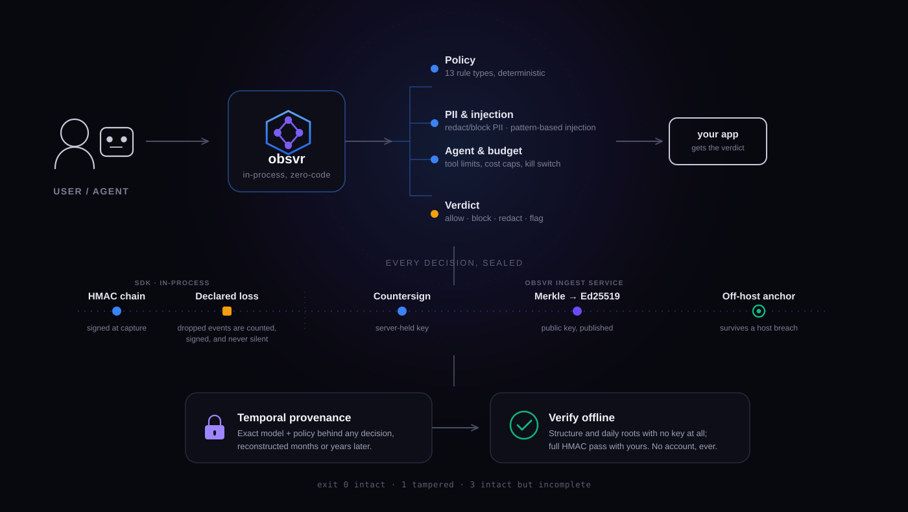
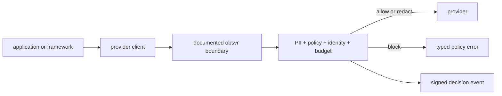
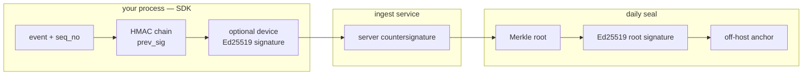

<div align="center">

# obsvr

### Enforce policy before AI actions execute. Preserve verifiable evidence afterward.

Obsvr runs inside your application to enforce deterministic policy before supported AI calls execute, then signs the resulting decision record so it can be independently verified later.


[](https://www.npmjs.com/package/@obsvr/sdk/v/0.14.0)
[](https://pypi.org/project/obsvr-sdk/0.14.0/)


[Website](https://obsvr.dev) · [TypeScript SDK](sdk-typescript/) · [Python SDK](sdk-python/) · [Security model](SECURITY.md) · [Compatibility](COMPATIBILITY.md)

</div>

---

<p align="center">
  
</p>

> **The SDKs are public; the ingest service is in private beta.** Local enforcement needs no account, but initialization requires a non-empty operator-chosen key because the SDK derives its HMAC signing key from it; omit the ingest URL for local-only use. Service-issued credentials enable delivery and do not enable a default block policy. [Request service access →](https://obsvr.dev)

| Package | Runtime | Version | Source |
| --- | --- | ---: | --- |
| [`@obsvr/sdk`](https://www.npmjs.com/package/@obsvr/sdk/v/0.14.0) | TypeScript / Node.js ≥ 22 | 0.14.0 | [`sdk-typescript/`](sdk-typescript/) |
| [`obsvr-sdk`](https://pypi.org/project/obsvr-sdk/0.14.0/) | Python ≥ 3.10 | 0.14.0 | [`sdk-python/`](sdk-python/) |

## Contents

- [Why obsvr](#why-obsvr)
- [Interception model](#interception-model)
- [Five-minute quickstart](#five-minute-quickstart)
- [Policy engine](#policy-engine)
- [Identity, attribution, and budgets](#identity-attribution-and-budgets)
- [Integration coverage](#integration-coverage)
- [The evidence model](#the-evidence-model)
- [AARM compatibility and strict execution receipts](#aarm-compatibility-and-strict-execution-receipts)
- [What's in this repo, what isn't, and why](#whats-in-this-repo-what-isnt-and-why)
- [Verify a record](#verify-a-record)
- [Cross-language conformance](#cross-language-conformance)
- [Performance](#performance)
- [Important limitations](#important-limitations)
- [Detailed documentation](#detailed-documentation)

## Why obsvr

AI systems call models, touch data, invoke tools, and spend money. Most application logs cannot reliably answer a later question:

> _What exactly did our AI do, which model issued the action, and what policy was in force at the time?_

Obsvr combines two jobs at the application boundary:

1. **Enforce now.** Deterministic policy, PII, approval, identity, tool, and budget controls run in-process on documented enforcing surfaces.
2. **Prove later.** Emitted decisions form a signed sequence that your ingest service can countersign and seal into an independently verifiable record.

This is **temporal provenance**: the action, decision, model, policy version, and captured content are bound together in the signed record for that call.

## Interception model

Obsvr has two entry points, and the distinction is part of the security boundary:

- **Explicit:** `obsvr.wrap(client)` governs the client instance you choose. It is dependency-light, works in both languages, and makes the interception point visible in code review.
- **Automatic:** TypeScript starts with `--import @obsvr/sdk/initialize`; Python starts through `obsvr-run`. These startup entry points initialize obsvr before application imports and intercept documented future provider, MCP-client, or agent construction where the upstream package exposes a safe pre-execution boundary. `@obsvr/sdk/register` plus an explicit `obsvr.init()` remains available when configuration must stay in code.

TypeScript uses an ESM load hook, a chained CommonJS loader hook, and construct-trap `Proxy` objects. Python rebinds supported provider and agent constructors and installs supported process-global framework gates before the application imports them. Neither runtime scans the heap or discovers clients that already exist. Explicit wrapping preserves the underlying real SDK client, keeping APM and OpenTelemetry integrations compatible with the same object.


```mermaid
flowchart LR
    app["application or framework"] --> client["provider client"]
    client --> boundary["documented obsvr boundary"]
    boundary --> decision["PII + policy + identity + budget"]
    decision -->|allow or redact| provider["provider"]
    decision -->|block| stop["typed policy error"]
    decision --> evidence["signed decision event"]
```

Coverage is intentionally described per integration rather than SDK-wide. A client constructed before the startup preload, imported through an unlisted package path, reached through a saved raw reference, or invoked through a framework callback delivered after execution may sit outside a given boundary. An escaped call records nothing rather than inventing an enforcement result. Use required binding manifests, explicit wrapping, or a pre-invocation tool gate when coverage must be unambiguous.

Production startup is not silent: TypeScript warns when agent or MCP policy is configured without the startup preload, and Python warns when automatic initialization begins after supported packages were already imported. In either runtime, exact `OBSVR_REQUIRED_BINDINGS` entries turn an expected automatic boundary into a startup requirement; Python applies the manifest to direct `init(auto=True)` as well as `obsvr-run`.

Use the smallest manifest that represents the boundaries your application must
have. These are exact surface keys, not product-wide claims:

| Required key | Runtime | What a successful bind proves |
| --- | --- | --- |
| `openai.client` | TypeScript, Python | documented future OpenAI client construction is intercepted |
| `anthropic.client` | TypeScript, Python | documented future Anthropic client construction is intercepted |
| `google.client` | TypeScript | documented future current and legacy Gemini construction is intercepted |
| `mcp.client` | TypeScript, Python | documented future MCP client/session construction receives the `tools/call` gate |
| `openai_agents.model` | TypeScript, Python | intercepted Agents receive concrete-model pre-call governance |
| `openai_agents.tools` | TypeScript, Python | intercepted Agents receive local function-tool and handoff gates, including supported later list mutations |
| `llamaindex.models` | Python | the process-global LlamaIndex model-start gate is installed |
| `crewai.tools` | Python | the supported CrewAI pre-tool hook is installed |
| `autogen.tools` | Python | the supported AutoGen/ag2 tool-execution gate is installed |

`openai_agents.model` and `openai_agents.tools` do not claim that Agents tracing,
hosted tools, or every future Agents SDK surface is governed.

### Signed deployment coverage

`signCoverageAttestation()` / `sign_coverage_attestation()` turns the current
binding report into a bounded, Ed25519-signed deployment statement. The body
records the workload, environment, SDK version, required integration symbols,
minimum enforcement depth, active policy-pack hashes, integration versions,
initialization times, and known exclusions.

| Required depth | A binding satisfies it when |
| --- | --- |
| `observe` | the symbol is bound as `observe` or `enforce` |
| `enforce` | the symbol is explicitly bound as `enforce` |
| legacy or ungraded binding | never satisfies an `enforce` requirement; it is normalized to `unknown` |

The signature proves the exact process-reported statement under an
operator-pinned key. It does **not** prove process-wide or network-wide
interception, discover calls through raw aliases, or turn a documented
exclusion into coverage. Consumers should reject expired attestations and any
statement with `coverage_complete: false`.

For caller-owned factories, verify the live deployment after construction:

| Check | TypeScript | Python | What it proves |
| --- | --- | --- | --- |
| Exact binding/depth | `assertCoverageRequirements(...)` | `assert_coverage_requirements(...)` | the named symbols are currently bound at the required depth |
| Deny smoke test | `assertEnforcementBoundary(...)` | `assert_enforcement_boundary(...)` / `_async(...)` | the supplied factory path rejects a known deny case with zero downstream calls |

These checks prove only the named binding and factory path. They do not discover
raw aliases or unrelated clients.

### Durable audit delivery

The default sender is an in-memory bounded queue. Applications that need local
crash recovery can opt into a disk-backed outbox:

| Runtime | Configuration | Status |
| --- | --- | --- |
| TypeScript | `durableDelivery: { directory: "/absolute/private/path" }` | `obsvr.deliveryStatus()` |
| Python | `durable_delivery={"directory": "/absolute/private/path"}` | `obsvr.get_delivery_status()` |

Each signed event is atomically persisted before enqueue returns, replayed after
restart, and removed only after ingest accepts it. Permanent refusal or retry
exhaustion moves the record to `dead/`; it is never relabeled as delivered.
The directory may contain governed content, so keep it private, encrypted and
subject to an explicit retention policy. Use a separate directory per process.

## Five-minute quickstart

### TypeScript

Install the ESM-only package:

```bash
npm install @obsvr/sdk
```

```typescript
import { obsvr } from "@obsvr/sdk";
import OpenAI from "openai";

obsvr.init({
  apiKey: process.env.OBSVR_API_KEY,
  ingestUrl: "https://your-ingest-service",
  environment: "production",
  piiPolicy: {
    default: "detect_only",
    rules: { ssn: "block", credit_card: "block", email: "redact" },
  },
});

const client = obsvr.wrap(new OpenAI());

await client.chat.completions.create({
  model: "gpt-4o",
  messages: [{ role: "user", content: "What is 2+2?" }],
});
```

For one-step startup governance, provide configuration through the environment and preload `initialize` before application imports:

```bash
OBSVR_API_KEY=... \
OBSVR_PII_POLICY='{"rules":{"ssn":"block"}}' \
OBSVR_AGENT_POLICY='{"deniedTools":["send_contract"]}' \
OBSVR_MCP_TOOL_POLICY='{"deniedTools":["delete_record"]}' \
OBSVR_REQUIRED_BINDINGS='openai.client,mcp.client,openai_agents.model,openai_agents.tools' \
NODE_OPTIONS="--import @obsvr/sdk/initialize" node app.js
```

This covers documented ESM and CommonJS provider-construction entry points, MCP `Client` construction, and OpenAI Agents model and function-tool boundaries at `Agent` construction and later assignment or list mutation. `obsvr.init()` alone does not install interception in TypeScript. Use `@obsvr/sdk/register` with explicit initialization when configuration stays in code, or `obsvr.wrap()` for an explicit instance boundary.

### Python

```bash
pip install obsvr-sdk
```

```python
import os
import obsvr
from openai import OpenAI

obsvr.init(
    api_key=os.environ["OBSVR_API_KEY"],
    ingest_url="https://your-ingest-service",
    environment="production",
    pii_policy={
        "default": "detect_only",
        "rules": {"ssn": "block", "credit_card": "block", "email": "redact"},
    },
)

client = obsvr.wrap(OpenAI())

client.chat.completions.create(
    model="gpt-4o",
    messages=[{"role": "user", "content": "What is 2+2?"}],
)
```

For initialization before application imports:

```bash
OBSVR_API_KEY=... \
OBSVR_PII_POLICY='{"rules":{"ssn":"block"}}' \
OBSVR_AGENT_POLICY='{"denied_tools":["send_contract"]}' \
OBSVR_MCP_TOOL_POLICY='{"denied_tools":["delete_record"]}' \
OBSVR_REQUIRED_BINDINGS='openai.client,mcp.client,openai_agents.model,openai_agents.tools' \
obsvr-run app.py
```

`obsvr-run -m package.module` is also supported. Python OpenAI and Anthropic constructors, future MCP `ClientSession` construction, supported CrewAI and AutoGen execution gates, Python LlamaIndex model-start callbacks, and future OpenAI Agents model and function-tool boundaries are auto-governed. OpenAI Agents model reassignment and later tool/handoff list mutations stay governed. Gemini, LangChain callbacks, LlamaIndex tool execution, hosted tools, and framework paths without a safe global pre-execution hook remain explicit. Applications that own import order can instead call `obsvr.init(auto=True)` before those packages are imported.

See the [TypeScript](sdk-typescript/README.md) and [Python](sdk-python/README.md) package guides for every supported method and configuration option.

### Govern application actions

Provider adapters cannot know about business actions such as sending a
contract. `governFn` and Python `@govern` put the same pre-execution tool-policy
kernel around any application callable:

```typescript
const sendContract = obsvr.governFn(rawSendContract, {
  name: "contract.send",
  consequence: "external_write",
});

await sendContract(contractId);
```

```python
@obsvr.govern(name="contract.send", consequence="external_write")
def send_contract(contract_id):
    return raw_send_contract(contract_id)
```

| Verdict | Function behavior |
| --- | --- |
| allow | the original callable runs |
| block | the callable is not entered |
| redact | the callable receives rewritten arguments; an unprovable rewrite fails closed |

TypeScript returns an async function because the shared policy pipeline may
wait for approval or an external backend. Python preserves the original sync
or async shape. A retained reference to the raw function remains a bypass and
is listed in the `govern_fn` coverage binding.

For strict decisions, `ActionContextV2` keeps context in bounded, closed
layers rather than accepting one arbitrary payload:

| Layer | Contents |
| --- | --- |
| agent and action | intent, scopes, classifications, argument hash, tokenized target |
| principal | stable principal id, principal kind, roles, optional tenant hash |
| execution | environment, autonomy level, consequence level |
| governance | integration/version, coverage-claim hash, active policy-pack hashes, approval and quota state |

Raw targets are replaced by a domain-separated hash. Unknown fields and
unbounded enum values are rejected, and existing v2 inputs produce exactly the
same canonical bytes as before.

### Deterministic remediation and retry

`buildRemediationPlanV1()` / `build_remediation_plan_v1()` turns `MODIFY`,
`STEP_UP`, or `DEFER` into a closed list of machine-readable requirements. A
requirement names its kind, stable code, evidence key, optional expected-value
hash, and bounded human guidance. It never contains a rewritten raw payload.

A retry is a new attempt, not continuation by implication. The retry document
must provide an evidence hash for every requirement and binds the new attempt
to the original attempt, original receipt, and remediation-plan hash. Put its
hash in the next `ActionContextV2.current_action.remediation_retry_hash` with
the parent and new attempt ids; the resulting context hash then travels into
the strict decision receipt.

### Operate policies across deployments

The SDKs expose matching, content-addressed contracts for the policy lifecycle.
They are building blocks for a deployment controller; they do not turn the SDK
into a general CMDB, GRC suite, or remote policy service.

| Contract | What it preserves | Safety boundary |
| --- | --- | --- |
| Policy lifecycle v1 | candidate artifact, replay impact, stable explanations, promotion thresholds, rollback target | a failed threshold returns the candidate to shadow; promotion never changes a live pack by itself |
| Workload registration v1 | workload, environment, deployment, capabilities, approvals, effective pack hashes, coverage-attestation hash | signed runtime metadata only; raw prompts, arguments, and customer data are rejected |
| Policy template v1 | template, typed parameters, rendered artifact, approval, activation, operator signature | whole-value placeholders only; no code execution or string interpolation |
| Control analytics v1 | exact event window, outcome counts, shadow divergence, approval indicators, latency, coverage and evidence gaps | reports only supplied events and never infers missing-event completeness |

### Use external evaluators as signals

`resolveSignalV1()` / `resolve_signal_v1()` records whether an evaluator is
deterministic or probabilistic, local or remote, plus its timeout, cache state,
failure disposition, provenance, and latency. The result is a fact for the
local deterministic kernel. It always carries `authoritative_allow: false`.

| Failure disposition | Kernel constraint |
| --- | --- |
| `deny` | require `DENY` |
| `defer` | require `DEFER` |
| `ignore` | record the failure without creating an allow decision |

OpenTelemetry, OPA, and Cedar helpers project the same bounded resolution for
correlation or policy input. OpenTelemetry is not signed evidence, and an
OPA/Cedar verdict still requires enforcement at an obsvr action boundary.

## Policy engine

Obsvr uses deterministic code in the decision path—never a second LLM. Rules cover keywords, bounded regex, topic allow/deny, model and environment gates, namespace and tenant isolation, destructive operations, source grounding, quotas, action gates, and parsed protocol facets.

```typescript
obsvr.init({
  policyRules: [
    {
      id: "no-wire-transfers",
      name: "Block wire transfers",
      enabled: true,
      action: "block",
      type: "keyword",
      conditions: { keywords: ["wire transfer"] },
      mode: "enforce", // or "shadow"
    },
  ],

  // Operator baseline: hooks, customer rules, and remote sync cannot weaken it.
  policyFloor: [
    {
      id: "floor-no-exfiltration",
      name: "No secret exfiltration",
      enabled: true,
      action: "block",
      type: "keyword",
      conditions: { keywords: ["exfiltrate secrets"] },
    },
  ],

  ruleResolution: "deny_wins",
  enforcementMode: "monitor",
  approvalWaitMs: 300_000,
  failMode: "closed",
});
```

Several mechanisms distinguish the engine from a simple prompt filter:

- **Explicit resolution semantics.** The compatible default is first-match in document order. `deny_wins` evaluates every enforcing rule and selects the strongest action regardless of position. The stamped `policy_version` commits to the selected semantics and, where relevant, rule order.
- **Shadow and monitor rollout.** A shadow rule records its would-have outcome without changing the call. Global monitor mode does the same across applicable layers while keeping integrity and canary-leak controls enforcing. Stable `reason_code` values appear on both signed events and typed policy errors.
- **Non-overridable floor.** `policyFloor` survives remote policy refresh and cannot be disabled, shadowed, or weakened by customer hooks. A floor redaction that cannot be guaranteed becomes a block.
- **Signed remote policy.** Pinning a policy public key makes fetched policy Ed25519-verifiable. Tamper, forgery, and rollback fail closed while the last-good policy continues enforcing.
- **Human approval.** A `require_approval` rule can refuse immediately for a later retry or hold the call while polling for a still-live grant. Grants can bind to the exact rule and a canonical action digest covering the action, amount, namespaces, and subject, so approval for one operation cannot authorize another. Timeout, revocation, kill-switch changes, and stale fail-closed state never become implicit approval.
- **Hostile-input hardening.** Customer regex rules are statically checked for catastrophic backtracking and run over bounded input. `protocol_facet` evaluates parsed SQL structure—verb, targets, tables, functions, and multiple statements—rather than matching raw text alone.
- **External engines.** Optional OPA and Cedar HTTP backends participate in the pre-call decision and merge deny-wins with the local outcome without replacing the floor. Their decision document contains operation, provider, model, principal, local outcome, rules hash, and a SHA-256 prompt digest—never the raw prompt. URLs are resolved and pinned against SSRF and DNS-rebinding targets, redirects are refused, and backend errors or timeouts deny in enforce mode; configure the backend itself as shadow-only for rollout without refusal.
- **Explainable failures.** `evaluate()` / `explain()` expose the policy decision without dispatching a provider call. A refused call throws `ObsvrPolicyError` with the stable reason code and deciding rule id, separating policy refusal from provider or transport failure without message parsing.

Policy is monotonic: a customer hook returning `allow` cannot erase an earlier PII, rule, or floor block. A requested redaction that cannot be applied safely blocks instead of forwarding raw content under a false verdict.

`policy_version` commits to the structured rules and their resolution semantics, not the complete effective evaluator. PII configuration, the policy floor, hooks, external-engine state, enforcement mode, and session state are separate recorded or derived inputs.

`sampleRate` / `sample_rate` controls clean audit-event emission only; it never disables enforcement on an enforcing boundary. Blocks, monitor-mode would-have decisions, detector failures, and other control evidence remain outside clean-allow sampling.

### PII and sensitive data

On enforcing wrappers, scanning runs over provider-bound textual roles before dispatch. A separate storage pass scans prompt and response content before an event is built. Each detected type resolves to `block`, `redact`, or `detect_only`; the last intentionally retains the value in the record.

The built-in tier covers 13 deterministic patterns including email, SSN, credit cards, credentials, private keys, and prompt-injection phrases. Six NLP entity types—names, people, addresses, locations, medical terms, and national IDs—require the optional Presidio integration. Inputs are Unicode-normalized, and optional bounded de-obfuscation views expose encoded or hidden forms. Prompt-injection matching remains deterministic defense-in-depth, not an ML jailbreak classifier or proof of prevention.

| Detection tier | Types |
| --- | --- |
| Built in | email, phone, SSN, credit card, IP address, API key, AWS access key, JWT, UUID, private key, GitHub token, Slack webhook, prompt injection |
| Presidio / NER | name, person, address, location, medical, national ID |

Default posture blocks credentials and high-risk identifiers, redacts common contact/network identifiers, and leaves the remaining types in `detect_only` for rollout. Policies can override those actions per type. Credit cards are Luhn-validated; IP addresses default to redaction because dotted-quad matching includes benign public, loopback, and version-like values.

Matching applies NFKC normalization, strips zero-width and bidirectional controls, and folds a curated set of cross-runtime confusables so Node and Python agree on the same payload. With de-obfuscation enabled, bounded base64, hex, percent-decoded, invisible-stripped, confusable-folded, and hidden-HTML views are scanned at depth one. A redaction found only in a decoded view has no safe source span, so it escalates to a block rather than claiming content was removed when it was not.

Observe-only model callbacks run only the storage posture: they may scrub the recorded copy but cannot stop or rewrite the provider request. Their event verdict is `not_evaluated`, with storage provenance recorded separately.

### Agent and MCP controls

Agent runs group governed model and tool calls under one signed run identity:

```typescript
await obsvr.agentRun("nightly-reconciliation", async () => {
  // Governed calls share one agent_run_id and signed lifecycle events.
});
```

MCP governance places policy at supported `tools/call` routes without patching the client prototype:

```typescript
import { obsvrGovernMCP, getConfig } from "@obsvr/sdk";

const GovernedClient = obsvrGovernMCP(RealClient, getConfig());
```

The agent layer includes tool allow/deny policy, step budgets, destructive-action locks, and a kill switch. MCP descriptor pinning hashes each tool definition at discovery so a benign tool silently replaced after approval can be flagged or removed. Operator-provided pins survive restarts; first-seen descriptors can be tracked with trust-on-first-use semantics.

A session-taint latch can mark a session after a detected injection or canary leak, then flag later egress or block destructive tools. Canary honeytokens provide a separate tripwire: plant one in a system prompt, retrieved context, or tool result, and resurfacing it produces a critical signed signal without storing the raw token.

Destructive capabilities should sit behind MCP, a framework-native pre-invocation guardrail, or `obsvrGovernTool` / `govern_tool`. Tracing callbacks alone cannot stop execution. Configuration and exact boundaries live in the [TypeScript SDK](sdk-typescript/README.md), [Python SDK](sdk-python/README.md), and [`SECURITY.md`](SECURITY.md#enforcement-semantics-what-blocking-means).

Startup auto-governance installs these same enforcing gates where construction, assignment, or a process-global hook is safely interceptable. TypeScript also governs compatible models assigned through the intercepted root `llamaindex` `Settings.llm` object after preload; tracing and agent tools remain separate. It does not upgrade a tracing callback into enforcement: LangChain remains an explicit callback binding, hosted tools stay provider-side, and LlamaIndex agent tools still need an explicit gate. Documented Python MCP sessions are intercepted at future construction, while intercepted OpenAI Agents keep later supported model assignments and local tool/handoff list mutations on their pre-call gates.

## Identity, attribution, and budgets

A governed call resolves one principal. Resolved identity fields feed the selected quota scope, session-taint scope, approval matching, and signed attribution, so enforcement identity and audit identity cannot silently diverge.

Resolution has fixed precedence:

1. Per-call metadata
2. The wrap-time or integration option
3. The ambient request subject

The ambient subject lets a long-lived governed client serve many end users without rebuilding the wrapper:

```typescript
import { useSubject } from "@obsvr/sdk";

await useSubject("user:alice;tenant:acme", async () => {
  await client.chat.completions.create(request);
});
```

```python
from obsvr import use_subject

with use_subject("user:alice;tenant:acme"):
    client.chat.completions.create(**request)
```

`requirePrincipal` / `require_principal` is opt-in and blocks a governed call with no non-blank principal before content scanning. Explicit identity always wins over ambient identity. Python ambient context crosses normal async tasks and `asyncio.to_thread`, but not arbitrary executor or raw-thread boundaries; pass `user_id` explicitly when work leaves the propagated context.

Request quotas, token budgets, and model gates are enforced at issuance and can be scoped by user, service, or tenant. Two boundaries matter:

- In-process counters are **per SDK instance**. A fleet-wide hard limit needs quota escrow from the ingest service or another upstream coordinator.
- Token usage is known after a response, so token budgets lag by one call. Request and model gates can decide entirely before dispatch.

Framework integration events are unmetered by default through `meterIntegrationEvents: false` / `meter_integration_events=False`; the explicit client wrapper remains metered. Enabling framework metering is an enforcement change, not merely extra telemetry: an existing token quota may begin refusing traffic that was previously outside its counter.

## Integration coverage

Explicit `obsvr.wrap()` is the clearest coverage boundary. Automatic and framework integrations vary by language and upstream API shape.

| Surface | TypeScript | Python |
| --- | :---: | :---: |
| OpenAI | explicit wrap or module interceptor | explicit wrap or auto-instrumentation |
| Anthropic | explicit wrap or module interceptor | explicit wrap or auto-instrumentation |
| Current and legacy Gemini clients | explicit wrap or module interceptor | explicit wrap |
| Azure OpenAI / AWS Bedrock / Google Vertex AI / Together | supported | supported |
| Cloudflare Workers AI / Vercel AI SDK | supported | — |
| MCP | supported | supported |

| Framework integration | TypeScript | Python |
| --- | :---: | :---: |
| OpenAI Agents SDK | ✅ | ✅ |
| LangChain | ✅ | ✅ |
| LlamaIndex | ✅ | ✅ |
| Vercel AI SDK | ✅ | — |
| CrewAI / AutoGen / Haystack / Pydantic-AI | — | ✅ |
| MCP | ✅ | ✅ |

A checkmark means an integration exists; it does not mean every callback can enforce. LangChain model-start callbacks enforce in both SDKs, and Python's LlamaIndex model-start callback enforces; because those callbacks cannot rewrite provider-bound input, a redaction request fails closed. TypeScript LlamaIndex tracing and OpenAI Agents tracing remain observe-only, with explicit model wrappers available for enforcement. Tool enforcement depends on a pre-invocation gate and differs by framework.

| Startup attachment | TypeScript | Python |
| --- | --- | --- |
| Direct-provider construction | OpenAI, Anthropic, current/legacy Gemini | OpenAI, Anthropic |
| MCP client construction | `Client` on documented MCP client exports | future `ClientSession` construction |
| OpenAI Agents model + function tools | future `Agent` construction and later supported assignments/mutations | future `Agent` construction and later supported assignments/mutations |
| CrewAI / AutoGen tool execution | no integration | process-global pre-execution gates on supported versions |
| LlamaIndex model calls | intercepted root `Settings.llm` assignment or explicit enforcing model wrapper | process-global model-start handler; redaction fails closed |
| LangChain | explicit callback binding | explicit callback binding |

### Does a tool-policy block actually stop the tool?

This compact grade describes the supported enforcement mechanism. The [security boundary inventory](SECURITY.md#enforcement-semantics-what-blocking-means) carries the evidence, routes, and version-specific caveats behind each cell.

| Surface | TypeScript | Python |
| --- | --- | --- |
| MCP | **enforces** | **enforces** |
| tool governor (`obsvrGovernTool` / `govern_tool`) | **enforces** | **enforces** |
| LangChain | **enforces** | **enforces** |
| Haystack | *no integration* | **enforces** |
| AutoGen | *no integration* | **enforces** |
| Pydantic-AI | *no integration* | **enforces** |
| OpenAI Agents | **enforces** | **enforces** |
| CrewAI | *no integration* | **enforces** |
| LlamaIndex | via `obsvrGovernTool` | **enforces** |
| Vercel AI SDK | via `obsvrGovernTool` | *no integration* |
| provider tool runners | **enforces** on supported local turns and tools | **enforces** on supported local turns and tools |

Read [`COMPATIBILITY.md`](COMPATIBILITY.md) for tested versions and evidence quality, and [the enforcement boundary inventory](SECURITY.md#enforcement-semantics-what-blocking-means) before placing a destructive capability behind a framework integration.

## The evidence model

Each emitted decision moves through three trust layers. They answer different questions and deliberately use different keys.


```mermaid
flowchart LR
    subgraph SDK["your process — SDK"]
      ev["event + seq_no"] --> hm["HMAC chain<br/>prev_sig"]
      hm --> ds["optional device<br/>Ed25519 signature"]
    end
    subgraph INGEST["ingest service"]
      cs["server countersignature"]
    end
    subgraph SEAL["daily seal"]
      mr["Merkle root"] --> ed["Ed25519 root signature"]
      ed --> an["off-host anchor"]
    end
    ds --> cs --> mr
```

1. **Client HMAC chain.** Every event carries an SDK session id, monotonic `seq_no`, and `prev_sig`. Chain format 4 signs the captured prompt and response; decision fields including `action_taken`, `action_reason`, `reason_code`, `rule_id`, `policy_version`, model, provider, and `user_id`; and classification fields `operation`, `source`, and `event_type`. Editing signed content, rewriting a verdict, reclassifying an ordinary event as a gap marker, or dropping or reordering an interior event breaks verification. `tenant_id`, token counts, cost, and anything that happened before emission remain outside the client preimage. Formats 1–3 remain verifiable at their original strength.
2. **Optional device signature.** An operator-generated Ed25519 key can sign the same preimage. A verifier with the pinned public key can then check content, order, and decisions without the API key, and detect a chain re-forged by an API-key holder. The SDK never generates or silently trusts this key.
3. **Server countersignature.** The ingest service signs the full accepted canonical event with a key that never enters the audited runtime, binding the event to its acceptance point.
4. **Daily public seal.** Accepted events fold into a daily Merkle root, signed with a published Ed25519 key and anchored off-host. Anyone holding the bundle and public key can verify the sealed root without trusting the client HMAC key.

### What each layer proves

- The **client HMAC** proves integrity and order for the supplied chain under the API key. Because HMAC is symmetric, an API-key holder can fabricate a valid client chain; it is not non-repudiation against that key holder.
- The **device signature** adds operator-held asymmetric attribution for the exact client preimage. It still cannot prove a provider actually produced the captured response.
- The **service seal** makes after-the-fact alteration, deletion, reordering, or post-acceptance timestamp modification of sealed accepted events detectable. The off-host anchor proves the sealed root existed no later than the anchor time; it does not establish the true client-side creation time of each event.
- None of these layers can observe a call that bypassed every SDK interception point. Coverage remains an integration property.

Delivery is bounded. Queue overflow is declared by a signed gap marker in the current chain; ingest rejection, permanent failure, or retry exhaustion starts a fresh session with a reasoned marker because the missing signed event prevents an honest continuation. A marker-bearing chain is valid but incomplete. The optional durable outbox persists signed events before enqueue, replays them after restart, and retains terminal failures in `dead/`. It reduces crash-loss windows but cannot record calls the SDK never intercepted, and loss of the outbox storage remains loss of the local recovery copy.

Verdicts use the fixture-pinned [`action_taken.json`](conformance/fixtures/action_taken.json) registry. `not_evaluated` means no enforcement gate ran; it is neither an allow nor a block.

Cross-language policy stamping and telemetry projection are pinned by [`effective_policy.json`](conformance/fixtures/effective_policy.json) and [`otel_attributes.json`](conformance/fixtures/otel_attributes.json); cryptographic and evaluation semantics live in the same conformance corpus.

Gap semantics are pinned by [`audit_gap.json`](conformance/fixtures/audit_gap.json). Offline client verification cannot prove it received every event: removing a valid suffix leaves a shorter valid chain, and clean allowed events may be sampled. Events are also not content-free; redaction and payload limits control what leaves the process, but there is no hashes-only delivery mode.

The full preimage, threat model, SSRF posture, failure semantics, and integration-by-integration enforcement boundaries are in [`SECURITY.md`](SECURITY.md).

## AARM compatibility and strict execution receipts

The SDKs include an **obsvr-authored AARM compatibility profile 1.0** for expressing a governed action as one of five outcomes: `ALLOW`, `DENY`, `MODIFY`, `STEP_UP`, or `DEFER`. The profile maps those outcomes to obsvr's existing decision vocabulary without changing the wire format. These fixtures are compatibility work, not official AARM conformance vectors, certification, or an AARM endorsement.

Strict receipt profile 2.1 adds an opt-in boundary for supported unary direct-provider calls:


```mermaid
flowchart LR
    call["cleaned provider call"] --> decide["intent + policy decision"]
    decide --> receipt["device-signed receipt"]
    receipt --> admit["positive ingest admission"]
    admit --> commit["local receipt commit"]
    commit --> started["invocation-started checkpoint"]
    started --> provider["provider call or governed side effect"]
    provider --> outcome["device-signed terminal outcome"]
```

- The exact JSON invocation, normalized provider endpoint, active intent, requested `model:invoke` scope, identity evidence, policy evidence, and a unique action id are bound into the decision receipt.
- The provider is contacted only after the receipt is admitted, committed locally, and durably checkpointed as `invocation_started`. A missing or ambiguous admission never falls back to an ungoverned call.
- `DENY`, `STEP_UP`, and `DEFER` do not execute. The direct-provider boundary also fails closed on `MODIFY`, because it does not accept an unverified argument transformation; only `ALLOW` crosses this boundary.
- A successfully finalized admitted invocation produces a device-signed terminal outcome that binds the execution start, decision receipt, status, and either a result digest or a bounded error classification. If terminal signing or persistence fails after execution starts, the durable journal remains unresolved; no terminal outcome is claimed. A decision receipt alone is therefore not presented as proof that execution succeeded.
- Once `invocation_started` is durable, an interrupted or ambiguous call is not automatically retried. Recovery validates the self-contained journal and any supplied signed outcome, but deliberately never labels a recovered action retry-safe. After a process restart, `finalizeInterruptedStrictRuntimeExecutionV21()` / `finalize_interrupted_strict_runtime_execution_v2_1()` can explicitly sign and durably save an `uncertain` outcome with `process_interrupted`; it does not guess whether the remote action succeeded.
- This profile is deliberately narrow: supported unary methods only. Python async-client paths, streams, helper managers, runners, and unsupported methods fail with `unsupported_surface`.

The same protocol can guard a provider-neutral side effect through `createStrictActionBoundaryV21` / `create_strict_action_boundary_v2_1`: the caller declares the action, target, data classifications, and requested scopes, and supplies the function that may run only after admission. Approval resolution is also explicit. A signed `STEP_UP` receipt is resumed through a new signed resolution receipt; the original action executes at most once only when the resolved outcome is `ALLOW`, or `MODIFY` with trusted effective arguments, and every binding still matches.

Strict profile 2.1 can also require approval separation of duties. Set
`approval_separation_of_duties` to `requester` or
`requester_and_initiator`; the trusted approval verifier must then return a
`principal_ref_hash` in the same pseudonymous identity namespace used by the
receipt. A self-approval fails before a resolution receipt can authorize the
action. The default is `none` for compatibility.

| Approval property | Strict profile 2.1 behavior |
| --- | --- |
| Exact action | Resolution must match the suspended receipt and `approval_action_hash`. |
| Expiry | A grant cannot outlive the suspension and is checked at resolution time. |
| Revalidation | Policy and trusted evaluation evidence are evaluated again. |
| Consume once | A committed resolution cannot execute the original action again. |
| Separation of duties | Optional pseudonymous requester and initiator checks reject self-approval. |

`submitStrictExecutionOutcomeV21()` / `submit_strict_execution_outcome_v2_1()` sends the exact signed terminal envelope to hosted strict ingest using the same bounded, DNS-pinned, no-redirect transport posture as receipt admission. Upload is caller-initiated: terminal outcomes remain in the durable checkpoint until the application submits the outcome or terminal journal, including after restart. Exact duplicates are idempotent. Transport failure is returned separately and never changes a locally recorded execution result. Only an exact matching `400`, `401`, `403`, or `413` response with `stored: false` is definitive non-storage; conflicts and ambiguous responses remain uncertain. The terminal-journal helpers verify the saved receipt, start, outcome, and signer bindings before upload.

Receipts and terminal outcomes can be exported as a portable, Ed25519-signed evidence bundle. Verification checks the exact schema, receipt-chain trust, outcome-to-decision bindings, policy continuity, coverage, and a bundle signature made by the head receipt signer. This SDK bundle does not itself contain hosted acceptance attestations, daily Merkle inclusion, or off-host anchors. Cross-language terminal-outcome bytes are pinned by [`strict_execution_outcomes_v2_1.json`](conformance/fixtures/strict_execution_outcomes_v2_1.json).

Strict checkpoints can also be correlated with the currently recording OpenTelemetry span through a checkpoint-store decorator. Correlation happens only after the durable save succeeds, exports content-free `obsvr.strict.*` references, and is best-effort telemetry rather than admission or execution authority. Its exact Python/TypeScript attribute sets are pinned by [`strict_otel_attributes_v2_1.json`](conformance/fixtures/strict_otel_attributes_v2_1.json).

Strict mode is not enabled by ordinary `wrap()` calls. Supply a profile 2.1 capability explicitly with `strict_receipt_v2_1` after configuring a device signer, intent policy, identity and evaluation evidence, admission, and a durable atomic checkpoint store. See the [Python](sdk-python/README.md#strict-profile-21-provider-boundary) and [TypeScript](sdk-typescript/README.md#strict-profile-21-provider-boundary) setup notes, the [security boundary](SECURITY.md#strict-profile-21-execution-boundary), and the [method matrix](COMPATIBILITY.md#strict-profile-21-direct-provider-boundary).

## What's in this repo, what isn't, and why

This Apache-2.0 repository contains the complete client implementation. The sealing service is separate because its keys and storage must live outside the runtime being audited.

| Capability | Where it runs | In this repo |
| --- | --- | :---: |
| Interception, policy, PII and injection detection, MCP/agent controls, budgets | your process | ✅ |
| Client HMAC chain, device signatures, gap markers | your process | ✅ |
| Strict decision receipts, signed terminal outcomes, recovery, and portable evidence bundles | your process / verifier | ✅ |
| `obsvr-verify` CLI and verification libraries | anywhere | ✅ |
| Cross-language behavioral contract | CI | ✅ |
| Server countersignature | ingest service | ❌ |
| Merkle sealing, Ed25519 root signing, off-host anchoring | ingest service | ❌ |
| Fleet registry, quota escrow, coverage reporting | ingest service | ❌ |

The split is a trust boundary, not a feature gate: a signer whose private key lives beside the events it signs cannot provide independent evidence against that runtime. The public SDK includes the algorithms, fixtures, and verifiers needed to inspect its side of the protocol without an Obsvr account.

## Verify a record

Both packages ship `obsvr-verify`, so a Python fleet needs no Node toolchain:

```bash
# Structural checks: sequence, links, timestamps, and chain format.
npx -p @obsvr/sdk obsvr-verify ./bundle.json
obsvr-verify ./bundle.json

# Recompute the client HMAC over content and decision fields.
npx -p @obsvr/sdk obsvr-verify ./bundle.json --api-key "$OBSVR_API_KEY"
obsvr-verify ./bundle.json --api-key "$OBSVR_API_KEY"

# Verify the optional operator-held device signature.
obsvr-verify ./bundle.json --device-pubkey ./device.pub
```

Keyless mode checks structure and order only. It reads no content, decision, or attribution field and recomputes no signature; changing a prompt or verdict can still pass that tier. Use the API key or a pinned device public key for integrity claims.

| Exit code | Meaning |
| ---: | --- |
| `0` | verified at the requested tier, with no declared loss |
| `1` | broken signature, link, or continuity |
| `2` | usage error |
| `3` | valid but incomplete—the chain declares dropped events |

`--allow-gaps` maps `3` to `0` for workflows that accept bounded loss without suppressing the disclosure. Both implementations are pinned to the same signing and gap fixtures; see [`SECURITY.md`](SECURITY.md#the-integrity-chain-what-it-proves) for completeness limits and the full verification boundary.

## Cross-language conformance

TypeScript and Python implement one fixture-pinned contract in [`conformance/fixtures/`](conformance/fixtures/). Cryptographic and canonicalization fixtures require byte-identical output; intended capability differences are catalogued rather than normalized away.

- [`signing_vectors.json`](conformance/fixtures/signing_vectors.json) pins the HMAC chain so either SDK can be verified by the same ingest implementation.
- [`eval_semantics.json`](conformance/fixtures/eval_semantics.json) and [`rules_hash.json`](conformance/fixtures/rules_hash.json) pin rule evaluation and `policy_version` derivation.
- [`reason_codes.json`](conformance/fixtures/reason_codes.json) and [`action_taken.json`](conformance/fixtures/action_taken.json) form closed decision registries. Both suites fail if a runtime emits a value outside them.
- [`normalization.json`](conformance/fixtures/normalization.json) pins the Unicode fold across Node and Python.
- [`tool_pinning.json`](conformance/fixtures/tool_pinning.json) and [`tool_content_hash.json`](conformance/fixtures/tool_content_hash.json) keep descriptor-rug-pull detection distinct from per-call tool evidence.
- [`strict_execution_outcomes_v2_1.json`](conformance/fixtures/strict_execution_outcomes_v2_1.json) pins the terminal record that binds a started action back to its admitted decision, while [`strict_otel_attributes_v2_1.json`](conformance/fixtures/strict_otel_attributes_v2_1.json) pins the content-free trace references projected after durable checkpoints.
- The same corpus exercises the obsvr-authored compatibility outcomes, structured action context, intent evaluation, and strict receipt formats through profile 2.1. The AARM compatibility vectors themselves remain explicitly non-claimable and are not official AARM conformance evidence.

The corpus is hash-pinned by `conformance/MANIFEST.sha256`; each SDK records the corpus hash its suite targets. CI fails when fixtures change without regenerated pins, the two pins disagree, or a fixture has no in-repository consumer. A behavior difference is release-blocking unless it is explicitly represented in the machine-readable divergence catalog and its validated narrative.

Normative evaluation semantics are in [`conformance/SPEC-evaluation.md`](conformance/SPEC-evaluation.md); accepted and repaired differences are in [`conformance/known-divergences.md`](conformance/known-divergences.md).

## Performance

Governance overhead is measured against an in-process mock provider so the SDK's own cost is isolated. Results below are p50 ranges from two 10,000-call passes on Apple M3 Pro with signing enabled:

| Configuration | TypeScript p50 | Python p50 |
| --- | ---: | ---: |
| Sign and enqueue | 24.7–25.1 µs | 97.6–100.0 µs |
| Five rules | 34.0 µs | 164.1–164.3 µs |
| Built-in PII scan | 48.6–48.9 µs | 268.7–286.7 µs |
| Full stack | 63.2–64.1 µs | 524.3–525.1 µs |
| Full stack, 10 KB prompt | 1.75–1.76 ms | 12.30–12.60 ms |

Provider latency is excluded. Full distributions, payload scaling, stress tiers, queue-loss results, retained artifacts, and methodology are in [`BENCHMARKS.md`](BENCHMARKS.md). The sender transport is asynchronous; the optional TypeScript OpenTelemetry mirror is the documented synchronous exception.

## Important limitations

1. **Startup interception is not process-wide discovery.** The TypeScript package API is ESM-only, but its startup preload additionally intercepts documented CommonJS entry points. Both SDKs govern supported objects constructed after their startup hook runs; OpenAI Agents also keeps later supported model assignments and tool/handoff list mutations governed. TypeScript governs compatible models assigned through the intercepted root LlamaIndex `Settings.llm`, but a saved pre-interceptor `Settings` reference or replacement outside that setter remains a bypass. Pre-existing objects, saved raw references, unlisted package paths, custom transports, replaced framework internals outside intercepted setters, and hosted tool execution remain outside the guarantee. Use exact startup keys for constructor-bound surfaces, then exact coverage requirements and a zero-transport factory smoke test after application factories run.
2. **Some tracing callbacks still observe rather than govern.** TypeScript LlamaIndex tracing and OpenAI Agents tracing cannot block or rewrite an outbound provider call. TypeScript LlamaIndex model enforcement uses the intercepted `Settings.llm` assignment or `obsvrGovernLlamaIndexLLM`; agent tools remain explicit. Use `governModel` / `govern_model` (or their model-provider variants) for Agents model enforcement. LangChain model-start callbacks enforce in both SDKs but remain explicitly installed; Python's LlamaIndex model-start callback enforces too.
3. **Tool enforcement is binding-specific.** Automatic startup attachment uses the same documented pre-invocation gates as explicit integration. It does not make late callbacks blocking or cover hosted tools. A framework may expose several invocation routes; use the documented pre-invocation integration, MCP, or a governed tool for destructive capabilities.
4. **Stream output is not withheld after dispatch.** Pre-call controls run before opening a supported stream, but post-call response scanning is audit-time and tokens reach the caller as they arrive.
5. **Fail-open is the default.** Set `failMode: "closed"` when detector or hook failure must refuse the call. Policy floors, canary leaks, and failed redaction remain fail-closed in either mode.
6. **Budgets are local unless coordinated externally.** In-process request and token budgets are per SDK instance, and token usage is known after the call; fleet-wide hard caps require service coordination or an upstream control.
7. **Delivery is bounded.** The in-memory sender can lose its pending suffix on process death. The optional durable outbox replays persisted signed events and dead-letters terminal failures, but its storage can fail or be lost and it does not make unobserved calls complete. Configure `failureMode: "error"` / `failure_mode: "error"`, protect the directory, and monitor delivery status when local durability is required.
8. **Compatibility evidence varies by surface.** Some integrations run against real upstream packages; others use hand-written fakes that model the expected integration shape. [`COMPATIBILITY.md`](COMPATIBILITY.md) and the [TypeScript](sdk-typescript/tests/README.md) / [Python](sdk-python/tests/README.md) test inventories state the evidence behind each claim.

## Detailed documentation

| Document | Use it for |
| --- | --- |
| [`sdk-typescript/README.md`](sdk-typescript/README.md) | TypeScript API, interception, integrations, and configuration |
| [`sdk-python/README.md`](sdk-python/README.md) | Python API, auto-instrumentation, integrations, and configuration |
| [`SECURITY.md`](SECURITY.md) | Threat model, signing boundaries, failure modes, SSRF, and enforcement matrices |
| [`COMPATIBILITY.md`](COMPATIBILITY.md) | Supported package ranges, tested versions, and evidence quality |
| [`BENCHMARKS.md`](BENCHMARKS.md) | Methodology, full distributions, stress tests, and retained results |
| [`conformance/SPEC-evaluation.md`](conformance/SPEC-evaluation.md) | Normative cross-language evaluation semantics |
| [`conformance/known-divergences.md`](conformance/known-divergences.md) | Accepted and repaired cross-language differences |
| [`integration-harness/README.md`](integration-harness/README.md) | Vendored integration-harness scope and commands |
| [`CHANGELOG.md`](CHANGELOG.md) | Release history and behavior changes |

## License

Apache-2.0 © obsvr. See [LICENSE](LICENSE) and [NOTICE](NOTICE).

Access, integration help, or security questions: **hello@obsvr.dev**
